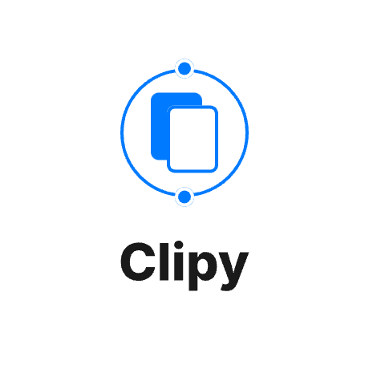
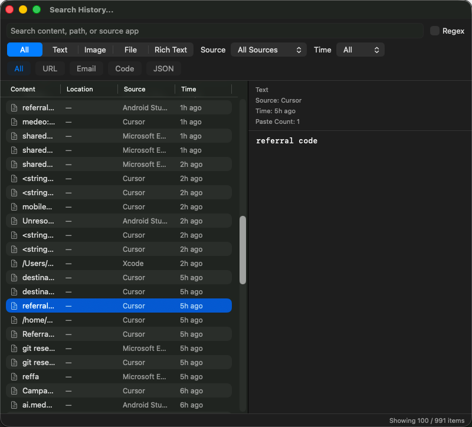

<div align="center">



# Clipy

**A native macOS menu-bar clipboard manager & screenshot tool, with encrypted LAN sync to your phone.**

Clipboard history · Snippets & hotkeys · Screenshot annotation & on-device OCR · Global search ·
Phone-notification mirror · AES-GCM encrypted sync & file transfer

[English](README.md) | [中文](README_ZH.md)

[](https://github.com/JunWeiUp/Clipy/releases)
[](https://github.com/JunWeiUp/Clipy/actions/workflows/release.yml)
[](#download)
[](#architecture)
[](LICENSE)
[](https://github.com/JunWeiUp/Clipy/stargazers)

</div>

---

## ✨ Why Clipy

Clipy lives in your menu bar and quietly supercharges your clipboard. Beyond saving everything you copy, it bundles a **full screenshot & annotation tool with on-device OCR**, a **global search across your history**, and **encrypted sync** that mirrors your Android phone's clipboard, files, and notifications straight to your Mac — no cloud, no account, everything stays on your local network.

- 🔒 **Privacy-first** — sync is end-to-end **AES-GCM 256-bit** encrypted and stays on your LAN; history can be encrypted at rest with keys in the macOS Keychain.
- ⚡ **Native & lightweight** — pure Swift/AppKit on macOS (stays out of your Dock), Flutter on mobile.
- 🌍 **Bilingual** — switch between 中文 and English at any time.

## 🖼️ Screenshots

<p align="center">
  
</p>

<p align="center"><sub>Global search (<kbd>⇧</kbd><kbd>⌘</kbd><kbd>F</kbd>) — regex, type / source-app / date filters, ranked results.</sub></p>

> Screenshots for the **screenshot & annotation tool** and **notification mirror** coming soon.

## 🚀 Features

### 📋 Clipboard history
- Captures **text, RTF, HTML, PDF, images, and files** automatically.
- **SHA-256 dedup** — re-copying an item moves it back to the top instead of duplicating.
- **File-aware** — shows the source file path and can reveal it in Finder.
- **Exclude apps** by bundle id (password managers, Keychain, etc.).
- Configurable history limit and lazy-loaded menu for a tiny memory footprint.
- Optional **at-rest encryption** of history media (keys in macOS Keychain).

### ✂️ Snippets (macOS)
- Organize reusable text/code in **folders**, drag-to-reorder.
- **Global hotkeys** per snippet/folder with a built-in shortcut recorder.
- **XML import/export** of your snippet library.

### 📸 Screenshot & annotation (macOS)
- Three capture modes: **region / window / fullscreen**.
- Full annotation toolbar: rectangle, arrow, ellipse, text, pencil, highlighter, eraser, **mosaic/blur**.
- **Magnifier** and **UI-element auto-snap** for pixel-perfect selections.
- **Pin to screen**, **save as**, copy, or run **OCR** right after capture.
- **On-device OCR** via Apple Vision — supports English, Chinese+English, and auto.
- Configurable save directory and a global hotkey (default <kbd>⇧</kbd><kbd>⌘</kbd><kbd>5</kbd>).

### 🔍 Global search (macOS)
- Summon with <kbd>⇧</kbd><kbd>⌘</kbd><kbd>F</kbd> from anywhere.
- **Regex** support, plus filters by **type, source app, and date**.
- Ranked results, multi-select, copy/paste, and pin straight from results.

### 🔄 Encrypted LAN sync & file transfer
- **AES-GCM 256-bit** encrypted transport between macOS, Android, and iOS.
- Devices discover each other via **Bonjour/mDNS** — no cloud, no account.
- **File transfer** in 128 KB chunks over a single ordered connection with **real-time progress**.
- Resilient: a bounded **offline-peer queue** re-delivers to devices that briefly drop off Wi-Fi.
- **Loop prevention** via content hashes, so copies never bounce between devices forever.

### 🔔 Phone-notification mirror (Android → macOS)
- See your Android phone's notifications right on your Mac.
- **Two-way** dismiss and clear-all; per-app **allow-list** filter.

### ⌨️ Global hotkeys & 🌍 i18n
- Hotkeys for search, screenshots, and every snippet.
- Chinese / English UI on every platform; **cross-platform** — native macOS, plus Android & iOS from one Flutter codebase.

<details>
<summary><b>🔐 A note on security</b></summary>

Sync traffic is encrypted with **AES-GCM 256-bit**, so the contents are confidential on your LAN. Be aware that the current pre-shared key is a fixed value rather than being uniquely paired per device; therefore peer authentication relies on the **user-curated authorized-devices list**. In short: it protects *what* you send, and *who* you accept from is controlled by you. We welcome contributions toward per-pair key negotiation.
</details>

## ⬇️ Download

Grab the latest build from the [**Releases**](https://github.com/JunWeiUp/Clipy/releases) page:

| Platform | Artifact |
| --- | --- |
| macOS 13+ | `ClipyClone-macOS-v<version>.zip` |
| Android (64-bit) | `ClipyClone-Android-arm64-v8a-v<version>.apk` |
| Android (32-bit) | `ClipyClone-Android-armeabi-v7a-v<version>.apk` |
| iOS | Build from source (Flutter) |

> On first launch, grant **Accessibility** (paste simulation), **Screen Recording** (screenshots), and **Local Network** (sync) permissions in System Settings → Privacy & Security.

## 🛠️ Build from source

### macOS (Swift / AppKit)
Requirements: **macOS 13+** and Xcode command-line tools.

```bash
./build_macos_app.sh
```

Generates `clipy_macos/ClipyClone.app` and installs it to `/Applications`.

### Android / iOS (Flutter)
Requirements: Flutter SDK and the Android SDK.

```bash
cd clipy_android
flutter pub get
flutter build apk --debug      # Android
# flutter build ios             # iOS
```

Release builds produce split APKs for `armeabi-v7a` and `arm64-v8a`.

## 🏗️ Architecture

**macOS app** — Swift + AppKit, native menu-bar app (`LSUIElement`, no Dock icon):
- `MenuController` — status-bar menu: history, snippets, devices, and actions.
- `ClipboardManager` — pasteboard polling, history persistence, dedup, sync dispatch.
- `SnippetManager` — folders, snippets, hotkeys, import/export.
- `SyncManager` — Bonjour discovery, length-prefixed TCP sync, AES-GCM encryption, hashing, file transfer.
- `ScreenshotCaptureService` / `CaptureOverlayWindow` — capture, annotation, pin, OCR.
- `SearchWindow` — global search with filters and ranking.
- `NotificationManager` — phone-notification mirror.
- `PreferencesManager`, `SettingsWindow`, `SnippetEditorWindow`, `LogWindow` — config & editing surfaces.

**Android/iOS app** — Flutter/Dart:
- `lib/main.dart` — tabbed UI (history, settings, logs, notifications, transfer).
- `lib/clipboard_manager.dart` — clipboard monitoring, history, sync coordination.
- `lib/sync_manager.dart` — service registration, discovery, TCP sync, encryption, file transfer, dedup.
- `lib/notification_manager.dart` — `NotificationListenerService` integration.

## 🔁 Sync protocol

Clipy uses a LAN-first protocol for clipboard and file data:

- **Discovery** — Bonjour/mDNS service `_clipy-sync._tcp`.
- **Transport** — raw TCP with a 4-byte big-endian length prefix per JSON frame (max 2 MB/frame).
- **File transfer** — 128 KB chunks over a single ordered connection, with metadata and real-time progress.
- **Compression** — gzip on text-like chunks when beneficial (identical rules on both ends).
- **Encryption** — AES-GCM 256-bit.
- **Authorization** — inbound accepted only from peers in each device's authorized list.
- **Loop prevention** — content hashes (`lastSyncHash`) prevent rebroadcast loops.

## 📁 Project structure

```
clipy_macos/Sources/      # macOS Swift/AppKit source
clipy_android/lib/        # Android & iOS Flutter/Dart source
build_macos_app.sh        # macOS app bundle build script
build_android_apk.sh      # Android split-APK build script
.github/workflows/        # Release CI
res/                      # README assets
assets/                   # Logo & app icons
```

## 🤝 Contributing

Issues and pull requests are welcome! Please open an issue first to discuss bigger changes. To contribute code:

1. Fork the repo and create a feature branch.
2. Make sure the macOS app builds with `./build_macos_app.sh` and/or the Flutter app with `flutter build apk`.
3. Open a pull request describing your change.

## 📦 Releasing

Releases are published automatically when pushing a version tag:

```bash
git tag v1.1.0
git push origin v1.1.0
```

The `Release` workflow can also be triggered manually from GitHub Actions with a version like `1.1.0`.

## 📄 License

Licensed under the [MIT License](LICENSE).

## ⭐ Star History

[](https://star-history.com/#JunWeiUp/Clipy&Date)

---

<div align="center">

If Clipy saves you time, consider giving it a ⭐ — it really helps others discover the project!

</div>
