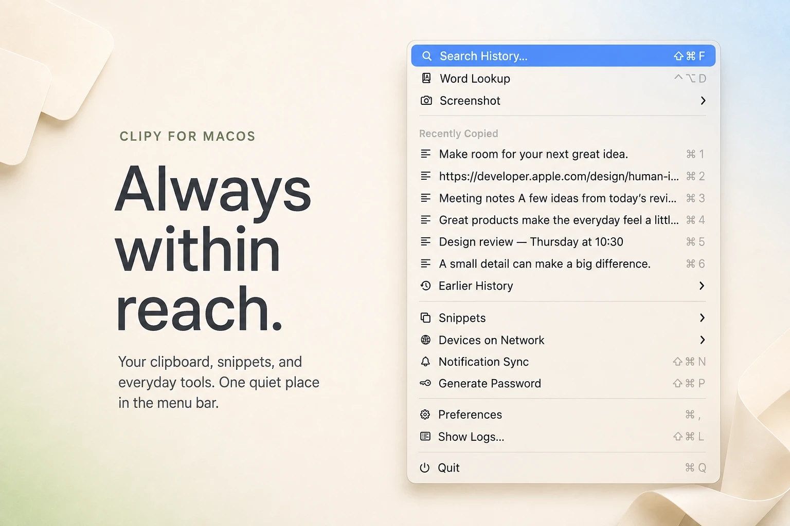
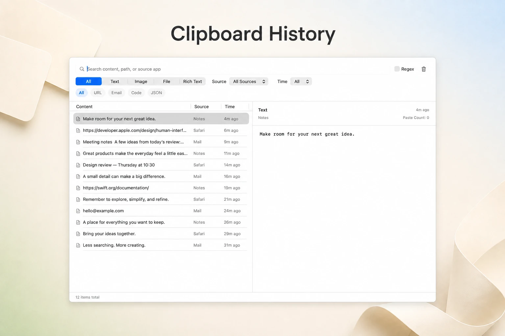
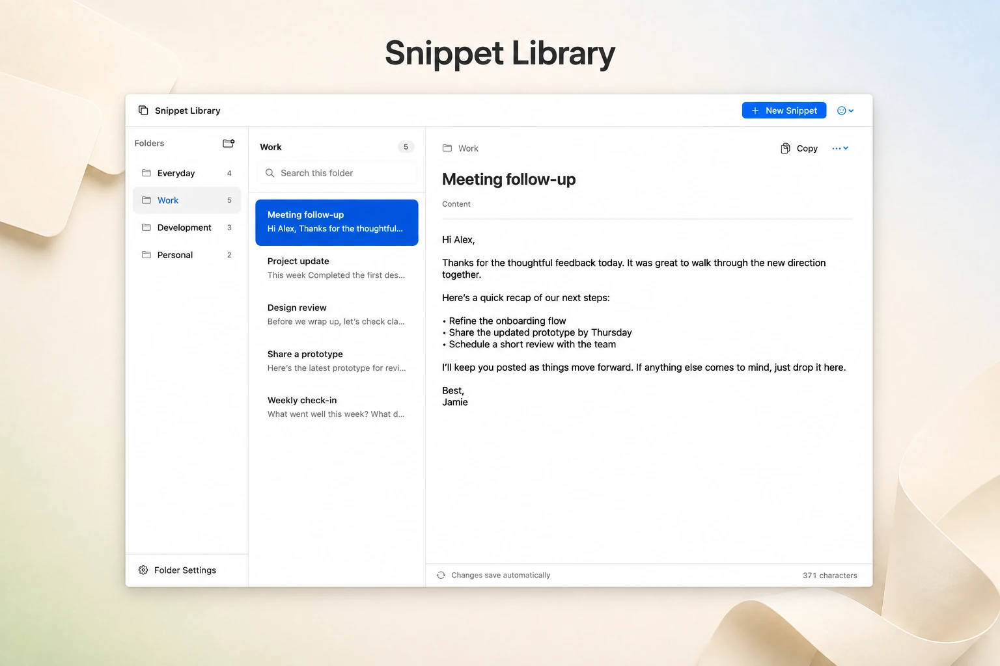
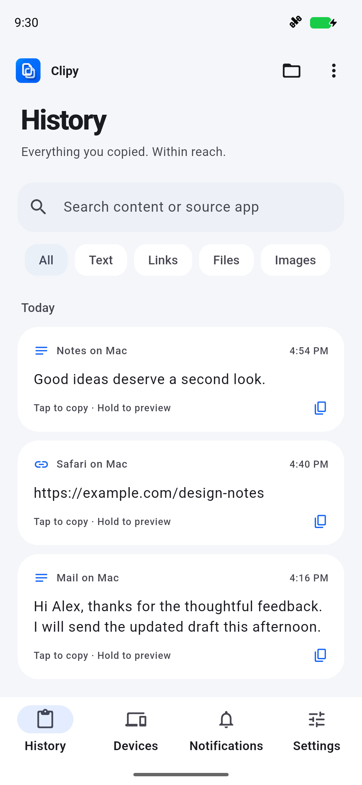
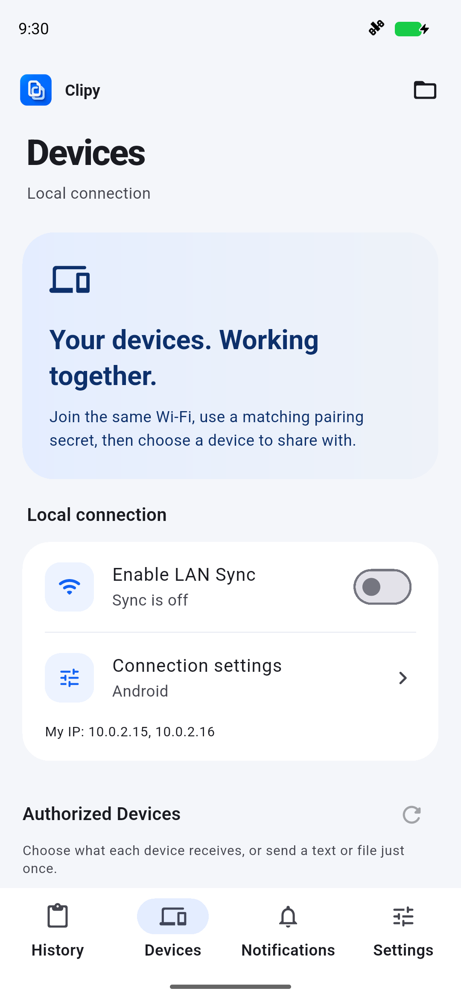
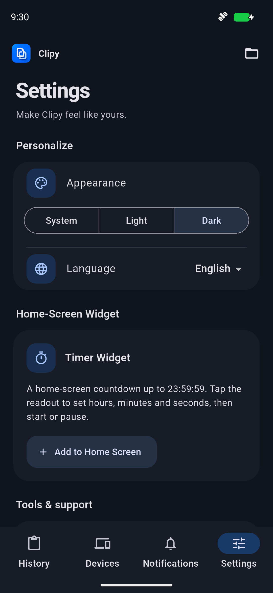
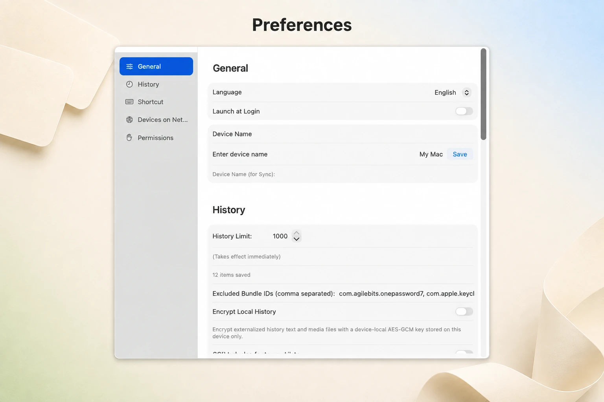

<div align="center">
  
  <h1>Clipy</h1>
  <h3>Copy here. Continue there.</h3>
  <p>A clipboard with a memory. A bridge between your Mac and Android.</p>
  <p><strong>English</strong> · <a href="README_ZH.md">简体中文</a></p>
  
  <br /><br />

**[Download for macOS ↗](https://github.com/JunWeiUp/Clipy/releases/download/v1.0.18/ClipyClone-macOS-v1.0.18.zip)** &nbsp;&nbsp; · &nbsp;&nbsp; **[Download for Android ↗](https://github.com/JunWeiUp/Clipy/releases/download/v1.0.18/ClipyClone-Android-arm64-v8a-v1.0.18.apk)**

<sub>Latest release: v1.0.18 · macOS 13+ / Apple Silicon · Android arm64 · <a href="docs/GETTING_STARTED.md#downloads">Other builds & installation</a></sub>

[](https://github.com/JunWeiUp/Clipy/releases)
[](https://github.com/JunWeiUp/Clipy/actions/workflows/ci.yml)
[](THIRD_PARTY_NOTICES.md)

**[A closer look](#a-closer-look)** · **[Android](#at-home-on-android)** · **[Get started](#get-started-in-three-steps)** · **[All features](#feature-reference)**

</div>

<br />

<table>
<tr>
<td width="33%" valign="top">

### Find it again.

That link. That paragraph. That thing you copied yesterday. Keep it in your history and bring it back with a search.

</td>
<td width="33%" valign="top">

### Take it with you.

Share clipboard content and send files between Mac and Android on your trusted local network. No account required.

</td>
<td width="33%" valign="top">

### Make it a shortcut.

Keep reusable replies and code in your Mac snippet library. Add a hotkey. Save yourself the next round of typing.

</td>
</tr>
</table>

## A closer look

### A little menu. A lot within reach.

Search, word lookup, screenshots and recent copies, right in your Mac menu bar. Native Swift / AppKit, with no Dock window to keep open.

<a href="res/screenshots/macos-menu-en.png"></a>

<table>
<tr>
<td width="50%" valign="top">

### Your clipboard, with a memory.

Filter by content type, source app or date. See the full preview before you reuse an item.

<a href="res/screenshots/macos-history-en.png"></a>

</td>
<td width="50%" valign="top">

### Good words deserve a second use.

Folders on the left, snippets in the middle, your writing on the right. Find, edit and copy without losing your place.

<a href="res/screenshots/macos-snippets-en.png"></a>

</td>
</tr>
</table>

**Capture an idea, too.** On Mac, take a screenshot, annotate it, extract text with OCR or pin it to your screen. Scrolling capture, screen recording and word lookup are also included. [Explore the tools ↓](#feature-reference)

## At home on Android

A fresh four-tab layout for **History · Devices · Notifications · Settings**. Search saved content, choose where to share, and switch between light, dark and system appearance. Short transitions preserve your place; copy feedback tells you when an action has finished.

<p align="center">
  <a href="res/screenshots/android-history-en.png"></a>&nbsp;
  <a href="res/screenshots/android-devices-en.png"></a>&nbsp;
  <a href="res/screenshots/android-settings-dark-en.png"></a>
</p>

<sub>Android previews show this working source revision; the redesign is not included in the v1.0.18 download above. Captures use fictional data in an isolated emulator. Mac showcase images use decorative styling and link to their original captures. The header is a concept illustration. [Image sources & production notes](res/screenshots/README.md)</sub>

<details>
<summary><b>One more detail: preferences that stay out of your way</b></summary>

Scroll continuously through Mac preferences, or jump to a category from the sidebar.

<a href="res/screenshots/macos-preferences-en.png"></a>

</details>

## Get started in three steps

1. **Install Clipy.** Move the Mac app to Applications, or install the Android APK. The Mac app lives in your menu bar. See the [installation guide](docs/GETTING_STARTED.md), including [first launch on macOS](docs/MACOS_INSTALL.md).
2. **Copy something worth keeping.** Keep Clipy open on Android for your first test. On Mac, press <kbd>⇧</kbd> <kbd>⌘</kbd> <kbd>F</kbd> to search your history.
3. **Connect your devices.** Use the same trusted Wi-Fi and matching private pairing secrets, then enable outgoing sharing for your chosen device. [Follow the connection steps](docs/GETTING_STARTED.md#connect-mac-and-android).

**[Installation & troubleshooting](docs/GETTING_STARTED.md)** · **[Report a problem](https://github.com/JunWeiUp/Clipy/issues/new?template=bug_report.yml)** · **[Suggest a feature](https://github.com/JunWeiUp/Clipy/issues/new?template=feature_request.yml)**

> **Before sharing:** sync is designed for trusted networks; set a strong private pairing secret. Read the [security boundaries](SECURITY.md). The macshot-derived screenshot module still needs a [third-party license review](THIRD_PARTY_NOTICES.md); the combined application must not be assumed to be MIT-only.

<details>
<summary><b>Versions, downloads and source builds</b></summary>

Current source version: **1.0.19** · Default local build **10080** · [Build metadata](clipy_android/pubspec.yaml)

The latest published release is [v1.0.18](https://github.com/JunWeiUp/Clipy/releases/tag/v1.0.18), build **10078**. The Android redesign is included in the v1.0.19 source and pending Release build. Release badges track published versions and exclude drafts. For differences from older versions, see [sync version notes](docs/GETTING_STARTED.md#sync-version-notes).

</details>

## Feature reference

<details>
<summary><b>Explore clipboard, screenshots, sync, and notifications</b></summary>

### 📋 Clipboard history
- Captures **text, RTF, HTML, PDF, images, and files** automatically.
- **SHA-256 dedup** — re-copying an item moves it back to the top instead of duplicating.
- **File-aware** — shows the source file path and can reveal it in Finder.
- **Exclude apps** by bundle id (password managers, Keychain, etc.).
- Configurable history limit and lazy-loaded menu for a tiny memory footprint.
- Optional **at-rest encryption** of history media (key stored in a local file with owner-only permissions; see [Security](SECURITY.md)).

### ✂️ Snippets (macOS)
- Organize reusable text/code in **folders**, drag-to-reorder.
- **Global hotkeys** per snippet/folder with a built-in shortcut recorder.
- **XML import/export** of your snippet library.

### 📸 Screenshot & annotation (macOS)
- Capture modes: **region / window / fullscreen / scrolling long-screenshot / screen recording (MP4 + GIF)**.
- **18-tool annotation engine** (ported from [macshot](https://github.com/sw33tLie/macshot)) on a single unified overlay: pencil (pressure + smoothing), line, **6 arrow styles** (curved/dashed/sketchy), rectangle, filled rectangle, ellipse, **marker (multiply blend)**, rich text (bold/italic/outline/background), auto-incrementing **number**, emoji/image **stamp**, **pixelate/blur/solid/erase censor**, **loupe magnifier**, **pixel ruler**, **color sampler**, **spotlight highlight**.
- Per-tool **secondary options bar** + glass primary toolbar + color/emoji/font/effects popovers.
- **Beautify** gradient wrapping + **image effects** (brightness/contrast/saturation/sharpness).
- **Scrolling capture** with live side preview (Vision-based frame-stitch).
- **Recording** with system-audio + microphone, webcam overlay, mouse-click highlight, keystroke display.
- **On-device OCR** + **QR** via Apple Vision; **auto-redact** PII; **Apple Translation** overlay.
- **Pin to screen** (zoom/opacity/rotate/edit), **floating thumbnail** feedback, **standalone editor** window (crop/flip/zoom), save-as, copy.
- Configurable save directory, single-key tool shortcuts, and a global hotkey.
- Fully localized (English + Simplified Chinese).

### 🔍 Global search (macOS)
- Summon with <kbd>⇧</kbd><kbd>⌘</kbd><kbd>F</kbd> from anywhere.
- **Regex** support, plus filters by **type, source app, and date**.
- Ranked results, multi-select, copy/paste, and pin straight from results.

### 📖 Word lookup (macOS)
- Open from the clipboard menu or press <kbd>⌃</kbd><kbd>⌥</kbd><kbd>D</kbd>; change or disable the shortcut in Preferences.
- Look up English words and short phrases for Chinese definitions, parts of speech, American IPA, word forms, related phrases and bilingual examples. Click a phrase to look it up.
- Play American pronunciation; if dictionary audio fails, use an installed system American English voice. Missing IPA, phrases or examples are shown explicitly.
- On opening, a single English word in the clipboard is automatically filled into the focused input; press Return to look it up. Sentences, URLs, files and multiple words are ignored. Queries require internet access and are sent to Youdao Dictionary only after submission; no lookup history is kept. Closing the window cancels requests and audio and releases results.
- Uses Youdao's web dictionary endpoints without an API key; these are not a versioned public API and may change or become unavailable. Each result links to its source.

### 🔄 Encrypted LAN sync
- **AES-GCM 256-bit** encrypted transport between macOS and Android.
- Devices discover each other via **/24 subnet scan** and **manual IP:port** (works across 2.4G/5G subnets) — no cloud, no account.
- Reliable **clipboard history** delivery with ack + offline queue.
- Resilient: a bounded **offline-peer queue** re-delivers to devices that briefly drop off Wi-Fi.
- **Loop prevention** via content hashes, so copies never bounce between devices forever.

### 🔔 Phone-notification mirror (Android → macOS)
- See your Android phone's notifications right on your Mac.
- **Two-way** dismiss and clear-all; per-app **allow-list** filter.

### macOS interface
- Native title bars, readable light/dark content surfaces, consistent SF Symbols, spacing and controls.
- Compact menu with quick tools and six recent clipboard entries; older history, snippets and devices are grouped in submenus.
- Preferences and screenshot settings scroll continuously across categories; the sidebar follows the visible section and supports click-to-jump. See the [macOS design standard](docs/MACOS_DESIGN.md) for UI development guidance.

### ⌨️ Global hotkeys & 🌍 i18n
- Hotkeys for search, word lookup, screenshots, and every snippet.
- Chinese / English UI; native macOS and Flutter Android. The iOS target is experimental and not built or device-tested in CI; Android-native features are not available there by default.

<details>
<summary><b>🔐 A note on security</b></summary>

Use sync only on trusted networks and configure a strong private pairing secret. An empty secret uses a public compatibility key and does **not** protect traffic from someone who knows the source. The authorized-devices list is not cryptographic identity verification; one-shot text/file transfers have different authorization rules. See [SECURITY.md](SECURITY.md) for the full limitations.
</details>

</details>

<details>
<summary><b>For developers: build, architecture, and protocol</b></summary>

## 🛠️ Build from source

Run the commands below from the repository root. If your network requires a proxy, enable your own shell configuration first (for example, `proxy` if you have that helper configured); the build scripts do not require a particular proxy command.

App icons share one approved master across macOS, Android and iOS. See the [icon assets and export guide](assets/branding/README.md) to regenerate all platform sizes and this README's logo.

### macOS (Swift / AppKit)

Requirements: **Xcode 26+** with the macOS 26 SDK. The application deployment target is macOS 13.

```bash
./build_macos_app.sh
```

Output: `clipy_macos/ClipyClone.app` and `clipy_macos/ClipyClone.app.dSYM`. The default build does **not** install or launch the app. To build, install into `/Applications`, and launch, first quit the running Clipy app, then run:

```bash
INSTALL_APP=1 LAUNCH_APP=1 ./build_macos_app.sh
```

Local macOS builds are ad-hoc signed, not Developer ID signed or notarized. See [build and signing options](docs/DEVELOPMENT.md#macos).

**Build on GitHub:** open [Actions → macOS Build](https://github.com/JunWeiUp/Clipy/actions/workflows/macos.yml) and choose **Run workflow** to build just the Mac app, with no signing secrets or Android setup. Pushes to `main`/`master` and pull requests run the same Mac job through CI.

After the Mac job succeeds, download its artifact from the run summary (GitHub sign-in required; retained for 30 days). It includes the **Apple Silicon / macOS 13+** app ZIP, symbols ZIP, SHA-256 checksums and installation instructions.

These are ad-hoc signed development builds, not published releases. See the [first-launch guide](docs/MACOS_INSTALL.md) for **Privacy & Security → Open Anyway** and permissions after updates. Version tags continue to create the existing combined Release draft.

### Android (Flutter)

Requirements: Flutter **3.41.7** (see `.fvmrc`), JDK 17 and the Android SDK.

Configure a persistent release keystore once on each build machine, using the ignored `clipy_android/android/key.properties` or the signing environment variables in the [Android signing guide](docs/DEVELOPMENT.md#android). Once configured, build with:

```bash
./build_android_apk.sh
```

Output: `dist/ClipyClone-Android-arm64-v8a-v<version>.apk` and `dist/ClipyClone-Android-armeabi-v7a-v<version>.apk`. The script resolves locked dependencies and signs both release APKs with your configured key. Keep the same key for future upgrades; never commit signing files or passwords.

For a debug build without release signing credentials:

```bash
(
  cd clipy_android
  flutter pub get --enforce-lockfile
  flutter build apk --debug --no-pub
)
```

Debug output: `clipy_android/build/app/outputs/flutter-apk/app-debug.apk`. Debug and release signing identities differ; do not assume in-place upgrades between them. Back up app data before any necessary uninstall/reinstall.

iOS remains experimental and is not validated by this project's CI.

### Versions and checks

Both root build scripts default to `version: X.Y.Z+N` in [`clipy_android/pubspec.yaml`](clipy_android/pubspec.yaml): `X.Y.Z` is the application version and `N` is the build number. `APP_VERSION` and `BUILD_NUMBER` can explicitly override them for a build. When changing versions, update **both README files** in the same change and keep build numbers increasing; installing over a newer CI build may require a higher `BUILD_NUMBER`.

The published v1.0.18 packages use build **10078** (source build 10060 + Release run 18). To replace that Android APK with a local build, retain the same signing key and explicitly set a higher `BUILD_NUMBER`; the default local build number is not the published package's build number.

Run `bash scripts/check.sh all` from the root for local quality checks. On macOS, also run `bash scripts/test_macos_core.sh` for search, word lookup and socket regressions; it uses a temporary test executable without installing or launching the app.

## 🏗️ Architecture

**macOS app** — Swift + AppKit, native menu-bar app (`LSUIElement`, no Dock icon):
- `MenuController` — status-bar menu: history, snippets, devices, and actions.
- `ClipboardManager` — pasteboard polling, history persistence, dedup, sync dispatch.
- `SnippetManager` — folders, snippets, hotkeys, import/export.
- `SyncManager` — subnet/manual discovery, length-prefixed TCP sync (protocol v2), AES-GCM encryption, reliable history + notification delivery.
- `Sources/Screenshot/` — the full screenshot/recording engine (ported from macshot): unified `OverlayView`, 18-tool annotation engine, scroll capture, recording, beautify/effects, OCR, pin, floating thumbnail, editor window. Driven by `ScreenshotSessionCoordinator`.
- `SearchWindow` — global search with filters and ranking.
- `NotificationManager` — phone-notification mirror.
- `PreferencesManager`, `SettingsWindow`, `SnippetEditorWindow`, `LogWindow` — config & editing surfaces.

**Android/iOS app** — Flutter/Dart:
- `lib/main.dart` — default entrypoint; `lib/app/` owns bootstrap and the headless bridge.
- `lib/features/` — device, history, settings, log and transfer pages.
- `lib/clipboard_manager.dart` — clipboard monitoring, history, sync coordination.
- `lib/sync_manager.dart` — subnet/manual discovery, TCP sync v2, encryption, history + notification delivery.
- `lib/notification_manager.dart` — `NotificationListenerService` integration.

## 🔁 Sync protocol

Clipy uses a LAN-first protocol v2 for clipboard history and notifications:

- **Discovery** — `/24` TCP port scan + manual `IP:port` peers (cross-subnet / dual-band).
- **Transport** — raw TCP with a 4-byte big-endian length prefix per JSON envelope (`v: 2`, max 2 MB/frame).
- **Messages** — `history`, `history.fetch`, `notif.post` / `dismiss` / `clear` / `ack`, `hello` / `welcome`, `ping` / `pong`, `ack`.
- **Encryption** — AES-GCM 256-bit on payloads (HKDF when a pairing secret is set).
- **Authorization** — outbound clipboard/notification push only to peers in each device's authorized list.
- **Reliability** — history frames require `ack` after persist; bounded offline queue + endpoint cache for reconnect.
- **Loop prevention** — content hashes prevent rebroadcast loops.

Full wire notes, headless Android channel rules, and code map: [`docs/PROTOCOL.md`](docs/PROTOCOL.md).

## 📁 Project structure

```
clipy_macos/Sources/      # macOS Swift/AppKit source
clipy_android/lib/        # Android & iOS Flutter/Dart source
build_macos_app.sh        # macOS app bundle build script
build_android_apk.sh      # Android split-APK build script
.github/workflows/        # CI + reviewed release drafts
res/                      # README assets
assets/                   # Logo & app icons
```

</details>

## 🤝 Contributing

Issues and pull requests are welcome in English or Chinese. See [CONTRIBUTING.md](CONTRIBUTING.md) and the [architecture map](docs/ARCHITECTURE.md). To contribute code:

1. Fork the repo and create a feature branch.
2. Run `bash scripts/check.sh all` and build the affected native platform.
3. Open a pull request describing your change.

## 📦 Releasing

After configuring release signing, update `clipy_android/pubspec.yaml` and both README files, then commit the changes. Push a **new, unused** version tag matching the source version to run CI and create a **draft** for maintainer review:

```bash
VERSION="$(awk '/^version:/ {split($2, v, "+"); print v[1]; exit}' clipy_android/pubspec.yaml)"
git tag "v${VERSION}"
git push origin "v${VERSION}"
```

The `Release` workflow can also be triggered manually with the matching `X.Y.Z` version. Do not move or overwrite existing version tags. Complete the [release checklist](docs/DEVELOPMENT.md#release-checklist), including licensing and signing review, before publishing the draft.

The workflow intentionally sets `draft: true`: a successful build does not automatically publish a release or make it Latest. After review, edit the draft on GitHub, leave **This is a pre-release** unchecked, select **Set as latest release**, and click **Publish release**. No rebuild or tag replacement is needed. Then update the published-version text and download links in both README files and both getting-started guides. See [GitHub's release instructions](https://docs.github.com/en/repositories/releasing-projects-on-github/managing-releases-in-a-repository).

Use the [release notes template](docs/RELEASE_NOTES_TEMPLATE.md) to explain user-visible changes, upgrade steps, and the platforms included in each release.

## 📄 License

The repository currently contains an [MIT License](LICENSE), but the macshot-derived screenshot module needs a separate license/provenance review. Do not assume the combined application is MIT-only. See [THIRD_PARTY_NOTICES.md](THIRD_PARTY_NOTICES.md).

## ⭐ Star History

[](https://star-history.com/#JunWeiUp/Clipy&Date)

---

<div align="center">

If Clipy saves you time, consider giving it a ⭐ — it really helps others discover the project!

</div>
