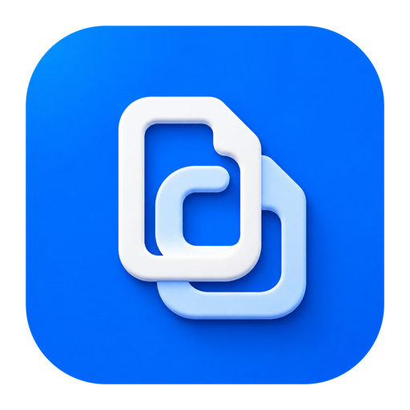
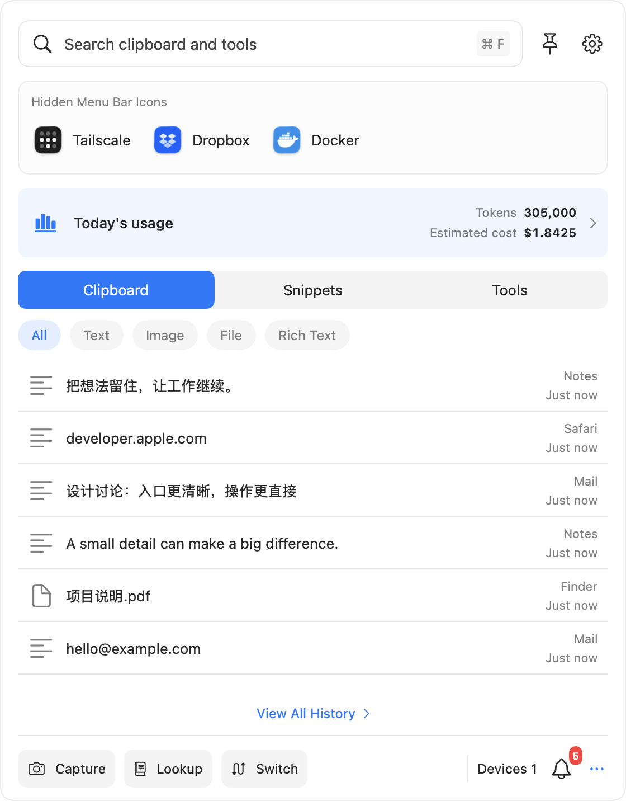
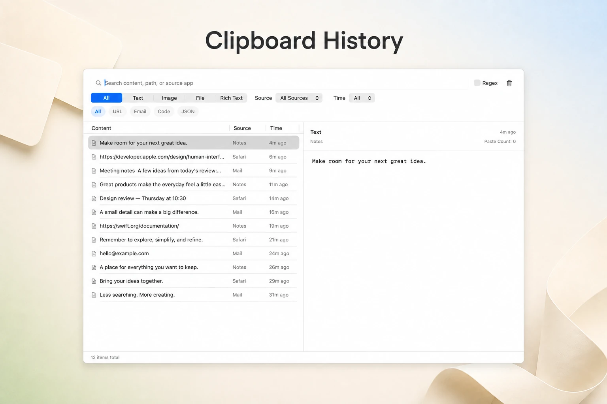
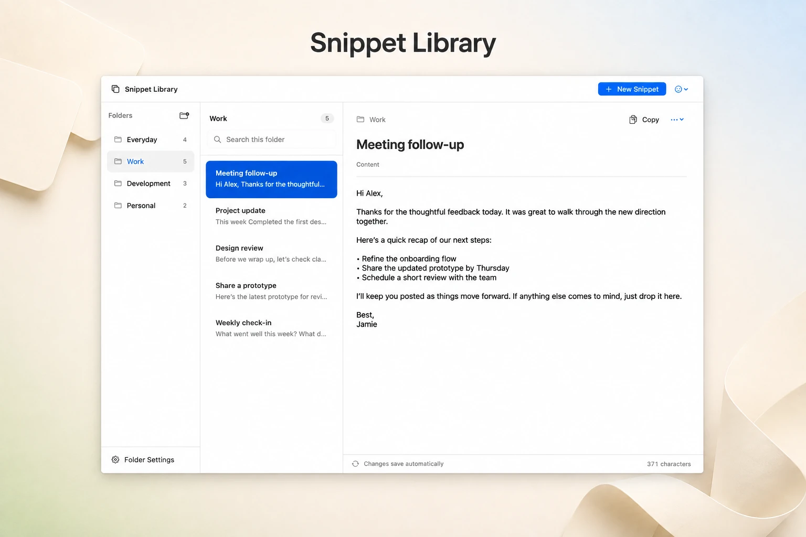
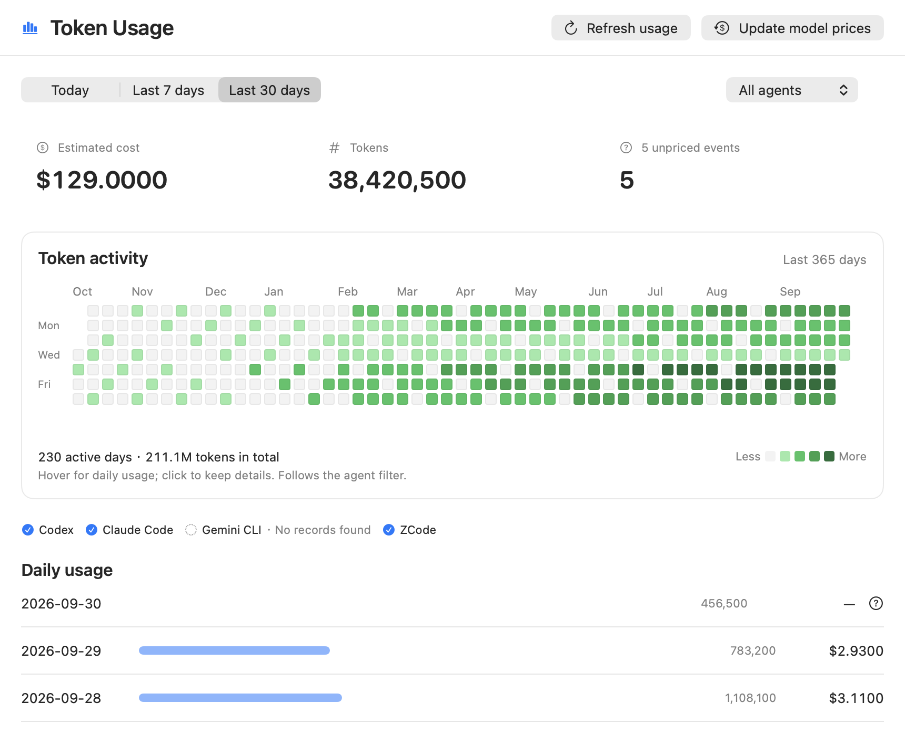
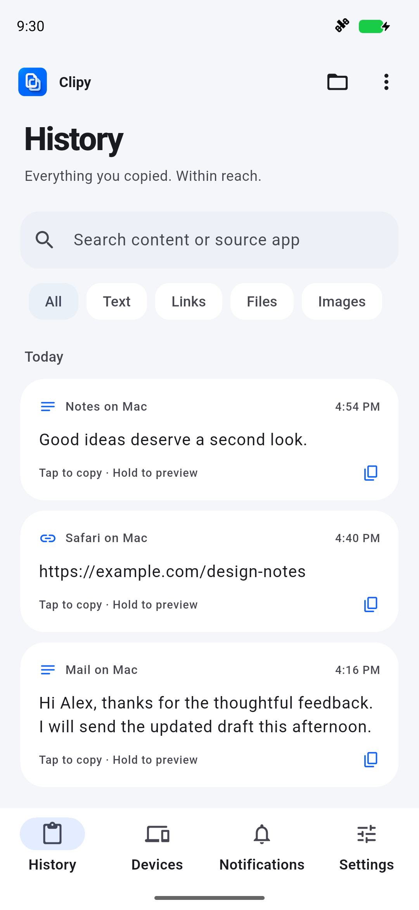
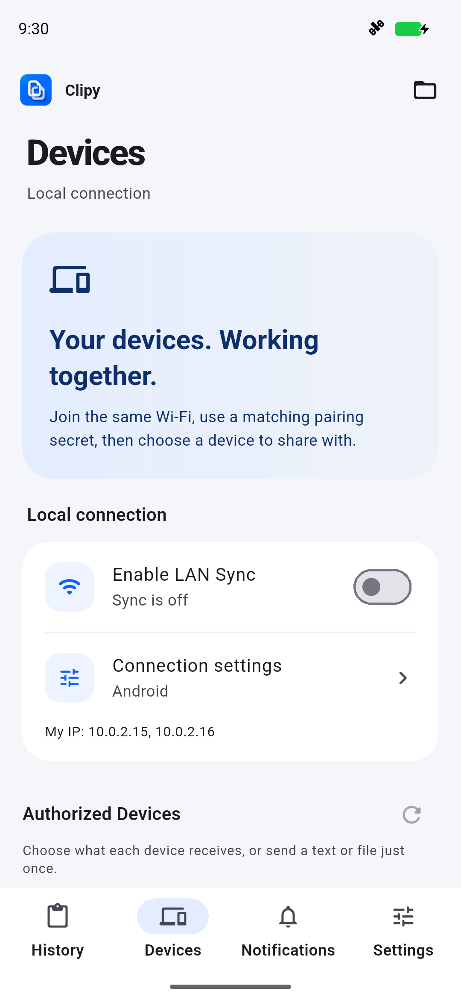
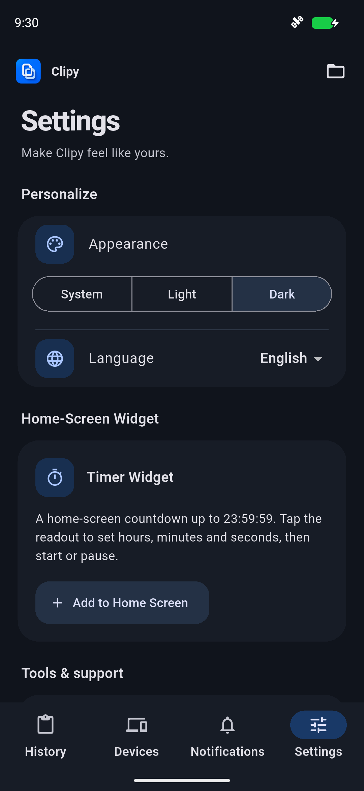
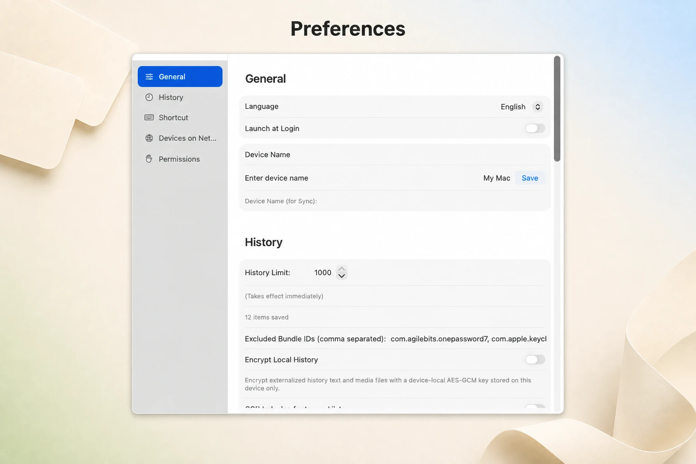

<div align="center">
  
  <h1>Clipy</h1>
  <h3>Copy here. Continue there.</h3>
  <p>A clipboard with a memory. A bridge between your Mac and Android.</p>
  <p><strong>English</strong> · <a href="README_ZH.md">简体中文</a></p>
  
  <br /><br />

**[Download for macOS ↗](https://github.com/JunWeiUp/Clipy/releases/latest)** &nbsp;&nbsp; · &nbsp;&nbsp; **[Download for Android ↗](https://github.com/JunWeiUp/Clipy/releases/latest)**

<sub>Latest published release linked above · macOS 13+ / Apple Silicon · Android arm64 · <a href="docs/GETTING_STARTED.md#downloads">Other builds & installation</a></sub>

[](https://github.com/JunWeiUp/Clipy/releases)
[](https://github.com/JunWeiUp/Clipy/actions/workflows/ci.yml)
[](THIRD_PARTY_NOTICES.md)

**[A closer look](#a-closer-look)** · **[Android](#at-home-on-android)** · **[Get started](#get-started-in-three-steps)** · **[All features](#feature-reference)**

</div>

<br />

<table>
<tr>
<td width="33%" valign="top">

### Find it again.

That link. That paragraph. That thing you copied yesterday. Keep it in your history and bring it back with a search.

</td>
<td width="33%" valign="top">

### Take it with you.

Share clipboard content and send files between Mac and Android on your trusted local network. No account required.

</td>
<td width="33%" valign="top">

### Make it a shortcut.

Keep reusable replies and code in your Mac snippet library. Add a hotkey. Save yourself the next round of typing.

</td>
</tr>
</table>

## A closer look

### Search from the menu bar.

The compact Mac panel puts search at the top, hidden menu bar icons below it, then today's Token usage and recent copies. Open snippets, tools and connected devices without keeping a Dock window open.

<p align="center"><a href="res/screenshots/macos-panel-en.png"></a></p>

<table>
<tr>
<td width="50%" valign="top">

### Your clipboard, with a memory.

Filter by content type, source app or date. See the full preview before you reuse an item.

<a href="res/screenshots/macos-history-en.png"></a>

</td>
<td width="50%" valign="top">

### Good words deserve a second use.

Folders on the left, snippets in the middle, your writing on the right. Find, edit and copy without losing your place.

<a href="res/screenshots/macos-snippets-en.png"></a>

</td>
</tr>
</table>

### See daily Agent usage.

Open the native Token Usage window from today's summary to inspect daily and model totals. Costs are estimates based on model prices, with unknown models kept visible as unpriced.

<p align="center"><a href="res/screenshots/macos-token-usage-en.png"></a></p>

**Capture an idea, too.** On Mac, take a screenshot, annotate it, extract text with OCR or pin it to your screen. Scrolling capture, screen recording and word lookup are also included. [Explore the tools ↓](#feature-reference)

## At home on Android

A fresh four-tab layout for **History · Devices · Notifications · Settings**. Search saved content, choose where to share, and switch between light, dark and system appearance. Short transitions preserve your place; copy feedback tells you when an action has finished.

<p align="center">
  <a href="res/screenshots/android-history-en.png"></a>&nbsp;
  <a href="res/screenshots/android-devices-en.png"></a>&nbsp;
  <a href="res/screenshots/android-settings-dark-en.png"></a>
</p>

<sub>Mac panel and Token Usage images are native source-build snapshots with fictional data; the history, snippets and preferences showcases use decorative styling and link to original captures. Android previews use an isolated emulator. The header is a concept illustration. [Image sources & production notes](res/screenshots/README.md)</sub>

<details>
<summary><b>One more detail: preferences that stay out of your way</b></summary>

Scroll continuously through Mac preferences, or jump to a category from the sidebar.

<a href="res/screenshots/macos-preferences-en.png"></a>

</details>

## Get started in three steps

1. **Install Clipy.** Move the Mac app to Applications, or install the Android APK. The Mac app lives in your menu bar. See the [installation guide](docs/GETTING_STARTED.md), including [first launch on macOS](docs/MACOS_INSTALL.md).
2. **Copy something worth keeping.** Keep Clipy open on Android for your first test. On Mac, press <kbd>⇧</kbd> <kbd>⌘</kbd> <kbd>F</kbd> to search your history.
3. **Connect your devices.** Use the same trusted Wi-Fi and matching private pairing secrets, then enable outgoing sharing for your chosen device. [Follow the connection steps](docs/GETTING_STARTED.md#connect-mac-and-android).

**[Installation & troubleshooting](docs/GETTING_STARTED.md)** · **[Report a problem](https://github.com/JunWeiUp/Clipy/issues/new?template=bug_report.yml)** · **[Suggest a feature](https://github.com/JunWeiUp/Clipy/issues/new?template=feature_request.yml)**

> **Before sharing:** sync is designed for trusted networks; set a strong private pairing secret. Read the [security boundaries](SECURITY.md). The macshot-derived screenshot module still needs a [third-party license review](THIRD_PARTY_NOTICES.md); the combined application must not be assumed to be MIT-only.

<details>
<summary><b>Versions, downloads and source builds</b></summary>

Current source version: **1.0.22** · Default local build **10118** · [Build metadata](clipy_android/pubspec.yaml)

Download installers from the [latest published release](https://github.com/JunWeiUp/Clipy/releases/latest); its notes identify the packaged version and build number. The Android redesign was released in v1.0.19. The source version above may be ahead of published packages while a release is being prepared. Release badges track published versions and exclude drafts. For differences from older versions, see [sync version notes](docs/GETTING_STARTED.md#sync-version-notes).

</details>

## Feature reference

<details>
<summary><b>Explore clipboard, screenshots, sync, and notifications</b></summary>

### 📋 Clipboard history
- Captures **text, RTF, HTML, PDF, images, and files** automatically.
- **SHA-256 dedup** — re-copying an item moves it back to the top instead of duplicating.
- **File-aware** — shows the source file path and can reveal it in Finder.
- **Exclude apps** by bundle id (password managers, Keychain, etc.).
- Configurable history limit and lazy-loaded menu for a tiny memory footprint.
- Optional **at-rest encryption** of history media (key stored in a local file with owner-only permissions; see [Security](SECURITY.md)).

### ✂️ Snippets (macOS)
- Organize reusable text/code in **folders**, drag-to-reorder.
- **Global hotkeys** per snippet/folder with a built-in shortcut recorder.
- **XML import/export** of your snippet library.

### 📸 Screenshot & annotation (macOS)
- Capture modes: **region / window / fullscreen / scrolling long-screenshot / screen recording (MP4 + GIF)**.
- **18-tool annotation engine** (ported from [macshot](https://github.com/sw33tLie/macshot)) on a single unified overlay: pencil (pressure + smoothing), line, **6 arrow styles** (curved/dashed/sketchy), rectangle, filled rectangle, ellipse, **marker (multiply blend)**, rich text (bold/italic/outline/background), auto-incrementing **number**, emoji/image **stamp**, **pixelate/blur/solid/erase censor**, **loupe magnifier**, **pixel ruler**, **color sampler**, **spotlight highlight**.
- Per-tool **secondary options bar** + glass primary toolbar + color/emoji/font/effects popovers.
- **Beautify** gradient wrapping + **image effects** (brightness/contrast/saturation/sharpness).
- **Scrolling capture** with live side preview (Vision-based frame-stitch).
- **Recording** with system-audio + microphone, webcam overlay, mouse-click highlight, keystroke display.
- **On-device OCR** + **QR** via Apple Vision; **auto-redact** PII; **Apple Translation** overlay.
- **Pin to screen** (zoom/opacity/rotate/edit), **floating thumbnail** feedback, **standalone editor** window (crop/flip/zoom), save-as, copy.
- Configurable save directory, single-key tool shortcuts, and a global hotkey.
- Fully localized (English + Simplified Chinese).

### 🔍 Global search (macOS)
- Summon with <kbd>⇧</kbd><kbd>⌘</kbd><kbd>F</kbd> from anywhere.
- **Regex** support, plus filters by **type, source app, and date**.
- Ranked results, multi-select, copy/paste, and pin straight from results.

### 🗣️ Smart app switch (macOS)

- Press <kbd>⌃</kbd><kbd>⌥</kbd><kbd>A</kbd> or choose **Smart App Switch** from the menu bar. The focused input selects Doubao if it is enabled; start Doubao voice input yourself, or type, then press Return. Return first confirms any active input-method composition. Esc cancels composition first; otherwise it closes the window and pastes the current text back into the originating app. Empty input or the window’s close button only dismisses it. If the original app is unavailable, the text remains on the clipboard.
- In **Preferences → Smart Switch**, add applications and give them names, aliases and descriptions, such as “browser / research” or “my code editor.” A clear match activates the running app or launches it; ambiguous results offer an Up/Down and Return selection. Missing apps can be located again. The shortcut can be changed, disabled or cleared.
- **App launch comes first:** in Smart mode, explicit commands such as “open ZCode” match enabled app names and aliases locally before any model request. Unique matches launch immediately; ambiguous aliases show candidates. Compound requests for a new ZCode conversation keep their new-chat action.
- **All six buttons stay visible:** Smart, Open app, New ZCode chat, Open Codex, Search web and Translate. New ZCode chat creates a projectless conversation and carries the full current input into its draft; empty input opens a blank chat. It never sends automatically. Open Codex activates or starts the installed desktop app without model setup.
- **Wheel cycling:** all actions appear in two rows, with no pages or overflow menu. Scroll over the buttons to select in either direction with wraparound, then press Return to execute. Clicking a button executes it when its required input is available. Text/result areas keep normal scrolling. Preferences lets you reorder the buttons and choose a search engine and translation language. Google is the default search engine.
- **Translation results:** model output appears directly below the Smart Switch title, in its own scrollable area for long text. Copy, reuse as input, or paste back without scrolling the action buttons away. When a result is visible, Esc pastes that result into the original app. Model setup is needed for semantic routing and translation; exact app matches, Open Codex and New ZCode chat also work without it.
- Configure a Chat Completions-compatible **Base URL** (including its version path, such as `/v1`, without `/chat/completions`), **model** and **API key**. Test the connection, then save. The app list and API settings start empty; clear all three API fields and save to remove the service configuration.
- Model-based actions send only the current input, allowed action IDs and enabled application names, aliases, descriptions and selection IDs to your chosen service. Translation sends the text you choose to translate. Paths and clipboard history are not uploaded. Keys stay in macOS Keychain; Clipy does not record audio or execute model-generated commands. Editing text, switching actions or closing cancels pending results.
- **Automatic voice entry (opt-in):** enable it in Preferences → Smart Switch and select the same hold-to-talk key as Doubao (Right Command by default; Right Option and Fn are also available). All apps use the same rule: confirmed text inputs and unresolved focus keep normal dictation; only confirmed non-text focus, such as a focused button or verified desktop, can open the input window. Window, group and web-page containers alone do not prove non-text focus. Clipy reads fresh control metadata on press and rechecks the same target after the hold threshold, using a bounded probe with limited retries. Timeouts, conflicting evidence and late responses cannot take over a gesture already passed to Doubao. Custom editors with incomplete accessibility information may require the regular Smart Switch shortcut. Dictate, release, then press Return. Dismissal restores the original app. Secure input, short taps and shortcuts pass through. Accessibility and Input Monitoring permissions are required; restart ClipyClone after granting them. Hands-free mode and voice buttons are not intercepted, and pauses in text do not trigger submission.

- The input uses a nonactivating panel: it accepts typing and dictation while the original application stays frontmost, avoiding an intermediate Clipy app-preset switch in peripheral tools. The panel releases keyboard focus before an app action; Escape still pastes back to the original application.
- Once a voice hold has requested the input window, an early release, peripheral preset change or input-readiness failure stops only voice forwarding. The window remains available for another hold or typing; Escape, close and successful actions still dismiss it normally.

### 📖 Word lookup (macOS)
- Open from the clipboard menu or press <kbd>⌃</kbd><kbd>⌥</kbd><kbd>D</kbd>; change or disable the shortcut in Preferences.
- Search in Chinese, English or with partial text. Chinese queries list English translations; bilingual suggestions and English spelling corrections open complete entries on selection. English entries include Chinese definitions, parts of speech, American IPA, word forms, phrases and bilingual examples. Click a phrase to look it up.
- Translate English phrases and full sentences into Chinese, or Chinese sentences into English, including punctuation and numbers (up to 500 characters). Unlisted phrases such as `Fine-grained personal` show a separate machine translation with copy and English read-aloud actions. Paste text into the input, then click **Look up** or press <kbd>⌘</kbd> + <kbd>Return</kbd>. Sentence translations are not added to Vocabulary.
- Play American pronunciation; if dictionary audio fails, use an installed system American English voice. Missing IPA, phrases or examples are shown explicitly.
- On opening, a single English word in the clipboard is automatically filled into the focused input; press Return to look it up. Sentences, URLs, files and multiple words are ignored. Queries require internet access and are sent to Youdao Dictionary only after submission. Complete dictionary entries are automatically saved to a local vocabulary book. Closing the window cancels requests and audio and releases results.
- Open **Vocabulary** from the menu or lookup window to review **Unfamiliar / Familiar** lists. Check a word to mark it familiar, or uncheck to move it back. Fuzzy search in Chinese or English supports partial text, skipped letters/characters, mixed keywords and English typo tolerance across headwords, meanings, inflections, phrases and examples; review saved IPA, definitions, word forms, phrases and examples offline, and play pronunciation online (with system voice fallback). Repeat lookups update the entry and lookup count while preserving familiarity. The vocabulary book stays on this Mac and is not synced. Previous versions did not retain lookups, so earlier queries cannot be recovered.
- Show or hide Chinese meanings in Vocabulary, including list summaries, definitions, phrase translations and example translations. The choice persists across window reopening and app restarts. The separate lookup window continues to show complete definitions.
- Uses Youdao's web dictionary endpoints without an API key; these are not a versioned public API and may change or become unavailable. Each result links to its source.

### 💰 Daily Token usage (macOS source builds)
- Clicking the menu-bar icon shows today's token count and estimated cost directly below the hidden-icons strip. Click the summary to open **Token Usage** for daily and model details, 1/7/30-day ranges and an agent filter; the classic right-click menu also has an entry.
- Reads existing local usage metadata from Codex, Claude Code, Gemini CLI and ZCode when the panel or window opens, then incrementally on later opens or manual refresh. The first scan imports available history. Clipy stores usage fields and hashed file cursors locally; it does not install hooks, keep a background polling timer, save prompts/responses or raw source paths, or sync usage to Android. Cursor is not included in this first version.
- USD amounts use bundled model prices and are **estimates, not subscription bills or actual charges**. Unknown models retain their token counts and appear as unpriced rather than $0. **Update model prices** is an explicit action that downloads [LiteLLM's pricing data](https://github.com/BerriAI/litellm/blob/main/model_prices_and_context_window.json); normal viewing works offline.

### 🔄 Encrypted LAN sync
- **AES-GCM 256-bit** encrypted transport between macOS and Android.
- Devices discover each other via **/24 subnet scan** and **manual IP:port** (works across 2.4G/5G subnets) — no cloud, no account.
- Reliable **clipboard history** delivery with ack + offline queue.
- **Mac-to-Mac folder transfer:** choose **Send File or Folder…** for a device. Updated Macs restore the folder in `~/Downloads/Clipy/`, preserving nested/empty folders and hidden files; name collisions create a new folder. Both Macs need this folder-transfer update for automatic restoration; older Macs and Android receive a regular ZIP instead. Each folder, including archive overhead, is limited to **512 MiB / 10,000 entries**; symbolic links and special files are rejected.
- Resilient: a bounded **offline-peer queue** re-delivers to devices that briefly drop off Wi-Fi.
- **Loop prevention** via content hashes, so copies never bounce between devices forever.

### 🔔 Phone-notification mirror (Android → macOS)
- See your Android phone's notifications right on your Mac.
- **Two-way** dismiss and clear-all; per-app **allow-list** filter.

### macOS interface
- **Hidden menu bar icons (source builds):** opt in under Preferences → General or the panel’s settings. On a single built-in display, overflowing items appear in a visible row below the panel search field with their original icon when capture succeeds, or an application icon and name otherwise. Clicking requests the original menu through Accessibility; some apps do not support this. Icons are never moved. Accessibility is required; Screen Recording is optional for original previews (macOS 14+). Dynamic status images are not guaranteed. External displays pause the feature.
- Native title bars, readable light/dark content surfaces, consistent SF Symbols, spacing and controls.
- Press <kbd>Esc</kbd> to close the focused window, including settings, search, word lookup, vocabulary, snippet and image/video editors, OCR results and pinned images. Existing save prompts still apply; input-method composition, shortcut recording and modal dialogs handle cancellation first.
- **Control panel (source builds):** left-click the menu-bar icon for a compact native panel with search in its top row, visible hidden icons, today's Token usage estimate directly below them, Clipboard / Snippets / Tools tabs, and device/notification pages. Search runs asynchronously across history, snippets and tools; six recent copies appear initially. Click a history row to copy and paste supported text formats; the row’s Copy button keeps the panel open. Pin it to keep it visible when clicking outside. Right-click the menu-bar icon for the classic native menu. The gallery above shows the current source build; published packages may differ.
- Preferences and screenshot settings scroll continuously across categories; the sidebar follows the visible section and supports click-to-jump. See the [macOS design standard](docs/MACOS_DESIGN.md) for UI development guidance.

### ⌨️ Global hotkeys & 🌍 i18n
- Hotkeys for search, word lookup, smart app switching, screenshots, and every snippet.
- Chinese / English UI; native macOS and Flutter Android. The iOS target is experimental and not built or device-tested in CI; Android-native features are not available there by default.

<details>
<summary><b>🔐 A note on security</b></summary>

Use sync only on trusted networks and configure a strong private pairing secret. Sync stays paused until a pairing secret is set; generate one on the Mac and scan its QR code with the Android camera, or type it on each device. There is no built-in fallback key. The authorized-devices list is not cryptographic identity verification; one-shot text/file transfers have different authorization rules. See [SECURITY.md](SECURITY.md) for the full limitations.
</details>

</details>

<details>
<summary><b>For developers: build, architecture, and protocol</b></summary>

## 🛠️ Build from source

Run the commands below from the repository root. If your network requires a proxy, enable your own shell configuration first (for example, `proxy` if you have that helper configured); the build scripts do not require a particular proxy command.

App icons share one approved master across macOS, Android and iOS. See the [icon assets and export guide](assets/branding/README.md) to regenerate all platform sizes and this README's logo.

### macOS (Swift / AppKit)

Requirements: **Xcode 26+** with the macOS 26 SDK. The application deployment target is macOS 13.

```bash
./build_macos_app.sh
```

Output: `clipy_macos/ClipyClone.app` and `clipy_macos/ClipyClone.app.dSYM`. The default build does **not** install or launch the app. To build, install into `/Applications`, and launch, first quit the running Clipy app, then run:

```bash
INSTALL_APP=1 LAUNCH_APP=1 ./build_macos_app.sh
```

Local macOS builds are ad-hoc signed, not Developer ID signed or notarized. See [build and signing options](docs/DEVELOPMENT.md#macos).

**Build on GitHub:** open [Actions → macOS Build](https://github.com/JunWeiUp/Clipy/actions/workflows/macos.yml) and choose **Run workflow** to build just the Mac app, with no signing secrets or Android setup. Pushes to `main`/`master` and pull requests run the same Mac job through CI.

After the Mac job succeeds, download its artifact from the run summary (GitHub sign-in required; retained for 30 days). It includes the **Apple Silicon / macOS 13+** app ZIP, symbols ZIP, SHA-256 checksums and installation instructions.

These are ad-hoc signed development builds, not published releases. See the [first-launch guide](docs/MACOS_INSTALL.md) for **Privacy & Security → Open Anyway** and permissions after updates. Version tags continue to create the existing combined Release draft.

### Android (Flutter)

Requirements: Flutter **3.41.7** (see `.fvmrc`), JDK 17 and the Android SDK.

Configure a persistent release keystore once on each build machine, using the ignored `clipy_android/android/key.properties` or the signing environment variables in the [Android signing guide](docs/DEVELOPMENT.md#android). Once configured, build with:

```bash
./build_android_apk.sh
```

Output: `dist/ClipyClone-Android-arm64-v8a-v<version>.apk` and `dist/ClipyClone-Android-armeabi-v7a-v<version>.apk`. The script resolves locked dependencies and signs both release APKs with your configured key. Keep the same key for future upgrades; never commit signing files or passwords.

For a debug build without release signing credentials:

```bash
(
  cd clipy_android
  flutter pub get --enforce-lockfile
  flutter build apk --debug --no-pub
)
```

Debug output: `clipy_android/build/app/outputs/flutter-apk/app-debug.apk`. Debug and release signing identities differ; do not assume in-place upgrades between them. Back up app data before any necessary uninstall/reinstall.

iOS remains experimental and is not validated by this project's CI.

### Versions and checks

Both root build scripts default to `version: X.Y.Z+N` in [`clipy_android/pubspec.yaml`](clipy_android/pubspec.yaml): `X.Y.Z` is the application version and `N` is the build number. `APP_VERSION` and `BUILD_NUMBER` can explicitly override them for a build. When changing versions, update **both README files** in the same change and keep build numbers increasing; installing over a newer CI build may require a higher `BUILD_NUMBER`.

Release builds add the Release workflow run number to the source build number. To replace a published Android APK with a local build, retain the same signing key and set `BUILD_NUMBER` above the installed build; the default local build number may be lower than a CI package with the same app version.

Run `bash scripts/check.sh all` from the root for local quality checks. On macOS, also run `bash scripts/test_macos_core.sh` for search, word lookup, smart app switching and socket regressions; it uses a temporary test executable without installing or launching the app. Smart Switch tests use mock API responses and do not require an API key or activate real applications. Optional `CLIPY_MENU_BAR_LIVE_TESTS=1 bash scripts/test_macos_core.sh` also creates temporary overflowing status items and verifies original menu/popover activation on a single built-in display with existing Accessibility permission; it does not install the app or move existing icons.

## 🏗️ Architecture

**macOS app** — Swift + AppKit, native menu-bar app (`LSUIElement`, no Dock icon):
- `MenuController` — status-bar menu: history, snippets, devices, and actions.
- `Sources/MenuBarOverflow/` — opt-in hidden status-item discovery, icon previews and direct Accessibility actions; local-only, without reordering.
- `ClipboardManager` — pasteboard polling, history persistence, dedup, sync dispatch.
- `SnippetManager` — folders, snippets, hotkeys, import/export.
- `SyncManager` — subnet/manual discovery, length-prefixed TCP sync (protocol v2), AES-GCM encryption, reliable history + notification delivery.
- `Sources/Screenshot/` — the full screenshot/recording engine (ported from macshot): unified `OverlayView`, 18-tool annotation engine, scroll capture, recording, beautify/effects, OCR, pin, floating thumbnail, editor window. Driven by `ScreenshotSessionCoordinator`.
- `SearchWindow` — global search with filters and ranking.
- `NotificationManager` — phone-notification mirror.
- `PreferencesManager`, `SettingsWindow`, `SnippetEditorWindow`, `LogWindow` — config & editing surfaces.

**Android/iOS app** — Flutter/Dart:
- `lib/main.dart` — default entrypoint; `lib/app/` owns bootstrap and the headless bridge.
- `lib/features/` — device, history, settings, log and transfer pages.
- `lib/clipboard_manager.dart` — clipboard monitoring, history, sync coordination.
- `lib/sync_manager.dart` — subnet/manual discovery, TCP sync v2, encryption, history + notification delivery.
- `lib/notification_manager.dart` — `NotificationListenerService` integration.

## 🔁 Sync protocol

Clipy uses a LAN-first protocol v2 for clipboard history and notifications:

- **Discovery** — `/24` TCP port scan + manual `IP:port` peers (cross-subnet / dual-band).
- **Transport** — raw TCP with a 4-byte big-endian length prefix per JSON envelope (`v: 2`, max 2 MB/frame).
- **Messages** — `history`, `history.fetch`, `notif.post` / `dismiss` / `clear` / `ack`, `hello` / `welcome`, `ping` / `pong`, `ack`.
- **Encryption** — AES-GCM 256-bit on payloads (HKDF when a pairing secret is set).
- **Authorization** — outbound clipboard/notification push only to peers in each device's authorized list.
- **Reliability** — history frames require `ack` after persist; bounded offline queue + endpoint cache for reconnect.
- **Loop prevention** — content hashes prevent rebroadcast loops.

Full wire notes, headless Android channel rules, and code map: [`docs/PROTOCOL.md`](docs/PROTOCOL.md).

## 📁 Project structure

```
clipy_macos/Sources/      # macOS Swift/AppKit source
clipy_android/lib/        # Android & iOS Flutter/Dart source
build_macos_app.sh        # macOS app bundle build script
build_android_apk.sh      # Android split-APK build script
.github/workflows/        # CI + reviewed release drafts
res/                      # README assets
assets/                   # Logo & app icons
```

</details>

## 🤝 Contributing

Issues and pull requests are welcome in English or Chinese. See [CONTRIBUTING.md](CONTRIBUTING.md), the [architecture map](docs/ARCHITECTURE.md) and the [change guide](docs/AI_CHANGE_GUIDE.md). To contribute code:

1. Fork the repo and create a feature branch.
2. Run `bash scripts/check.sh all` and build the affected native platform.
3. Open a pull request describing your change.

## 📦 Releasing

After configuring release signing, update `clipy_android/pubspec.yaml` and both README files, then commit the changes. Push a **new, unused** version tag matching the source version to run CI and create a **draft** for maintainer review:

```bash
VERSION="$(awk '/^version:/ {split($2, v, "+"); print v[1]; exit}' clipy_android/pubspec.yaml)"
git tag "v${VERSION}"
git push origin "v${VERSION}"
```

The `Release` workflow can also be triggered manually with the matching `X.Y.Z` version. Do not move or overwrite existing version tags. Complete the [release checklist](docs/DEVELOPMENT.md#release-checklist), including licensing and signing review, before publishing the draft.

The workflow intentionally sets `draft: true`: a successful build does not automatically publish a release or make it Latest. After review, edit the draft on GitHub, leave **This is a pre-release** unchecked, select **Set as latest release**, and click **Publish release**. No rebuild or tag replacement is needed. Then update the published-version text and download links in both README files and both getting-started guides. See [GitHub's release instructions](https://docs.github.com/en/repositories/releasing-projects-on-github/managing-releases-in-a-repository).

Use the [release notes template](docs/RELEASE_NOTES_TEMPLATE.md) to explain user-visible changes, upgrade steps, and the platforms included in each release.

## 📄 License

The repository currently contains an [MIT License](LICENSE), but the macshot-derived screenshot module needs a separate license/provenance review. Do not assume the combined application is MIT-only. See [THIRD_PARTY_NOTICES.md](THIRD_PARTY_NOTICES.md).

## ⭐ Star History

[](https://star-history.com/#JunWeiUp/Clipy&Date)

---

<div align="center">

If Clipy saves you time, consider giving it a ⭐ — it really helps others discover the project!

</div>
