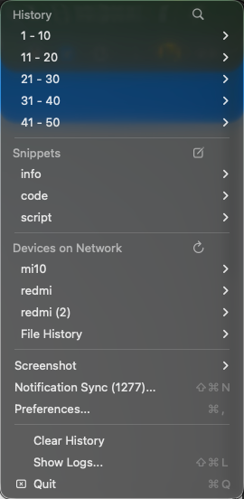
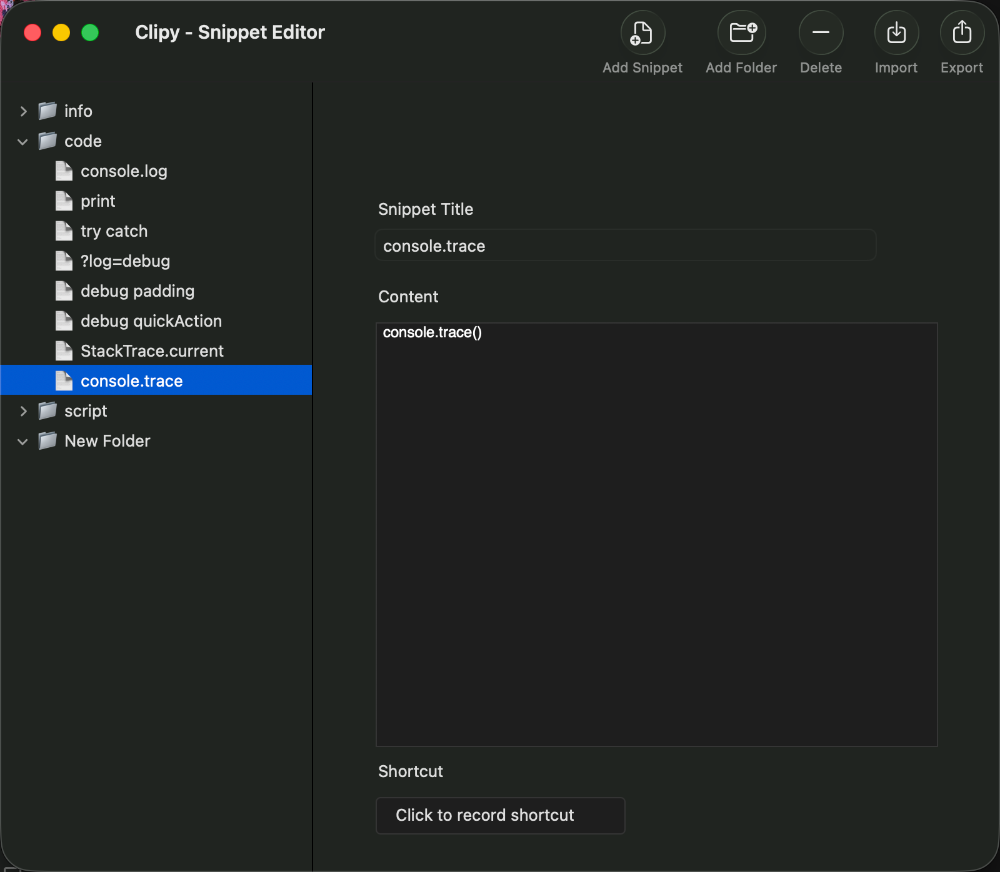

# Clipy

中文 | [English](README.md)

Clipy 是一个适用于 macOS 和 Android 的跨平台剪贴板管理工具。它可以保存剪贴板历史、管理常用片段、在局域网内传输文件，并在附近设备之间同步数据。

## 功能亮点

- **剪贴板历史**：自动监控、去重并保存剪贴板内容。
- **片段管理**（macOS）：按文件夹管理常用文本或代码片段，并支持快速粘贴。
- **局域网同步**：在同一局域网内同步 macOS 与 Android 设备的剪贴板历史。
- **局域网文件传输**：设备之间直接发送文件，macOS 支持悬停操作，Android 支持实时进度。
- **安全传输**：网络数据使用 AES-GCM 256 位加密，并通过预共享密钥保护。
- **实时日志**：内置日志窗口，方便查看同步、传输和调试信息。
- **自定义设备名称**：为每台设备设置易识别的名称。
- **中英文界面**：macOS 与 Android 均可在偏好设置中切换中文和英文。

## 截图

### macOS 菜单栏



### 片段编辑器



## 项目架构

### macOS 应用

- 使用 Swift 和 AppKit 构建原生菜单栏应用。
- `MenuController` 负责状态栏菜单、历史、片段、设备列表和菜单操作。
- `ClipboardManager` 轮询系统剪贴板、持久化历史、处理去重并触发同步。
- `SnippetManager` 管理文件夹、片段、快捷键和导入导出（仅本地）。
- `SyncManager` 负责 Bonjour 发现、带长度前缀的 TCP 同步、AES-GCM 加密、哈希去重和文件传输。
- `SettingsWindow`、`SnippetEditorWindow` 和 `LogWindow` 提供主要配置、编辑和日志界面。

### Android 应用

- 使用 Flutter 和 Dart 构建。
- `lib/main.dart` 包含历史、采集器、偏好设置、日志和传输操作的 Tab 化界面。
- `lib/clipboard_manager.dart` 监听剪贴板变化、保存历史并协调同步事件。
- `lib/sync_manager.dart` 负责服务注册、设备发现、TCP 同步、加密、文件传输和去重。
- `lib/app_localizations.dart` 提供中文和英文文案资源。

## 同步协议

Clipy 使用面向局域网的同步协议处理剪贴板和文件数据：

- **设备发现**：通过 Bonjour/mDNS（`_clipy-sync._tcp`）发现同一网络内的设备。
- **传输方式**：原生 TCP，每条 JSON 消息带 4 字节大端长度前缀（单帧上限 2 MB）。
- **数据负载**：剪贴板和文件消息使用 JSON，并在传输前加密。
- **文件传输**：文件按 128 KB 分块，通过单条有序连接发送，带元数据和实时进度反馈。
- **压缩方式**：文本类文件分块在有收益时使用 gzip 压缩（两端规则一致）。
- **加密方式**：使用 AES-GCM 256 位加密。
- **入站鉴权**：仅接受各设备授权列表中已勾选设备的入站消息。
- **环路防止**：使用 `lastSyncHash` 等内容哈希避免设备间重复广播。

## 构建

### macOS

要求：已安装 Xcode 命令行工具。

```bash
./build_macos_app.sh
```

脚本位于仓库根目录，生成 `clipy_macos/ClipyClone.app` 并安装到 `/Applications`。

### Android

要求：已安装 Flutter SDK 和 Android SDK。

```bash
cd clipy_android
flutter pub get
flutter build apk --debug
```

Release 构建由 GitHub workflow 生成 `armeabi-v7a` 和 `arm64-v8a` 两个分 ABI APK。

## 项目结构

- `clipy_macos/Sources/`：macOS Swift/AppKit 源码。
- `build_macos_app.sh`：macOS 应用包构建脚本。
- `clipy_android/lib/`：Android Flutter/Dart 源码。
- `.github/workflows/release.yml`：GitHub Release 自动化流程。
- `res/`：README 图片资源。

## GitHub Release

推送版本标签时会自动构建并发布 GitHub Release：

```bash
git tag v1.0.0
git push origin v1.0.0
```

也可以在 GitHub Actions 中手动运行 `Release` workflow，并输入类似 `1.0.0` 的版本号。

发布产物：

- `ClipyClone-macOS-v<version>.zip`
- `ClipyClone-Android-armeabi-v7a-v<version>.apk`
- `ClipyClone-Android-arm64-v8a-v<version>.apk`

## 许可证

内部项目。
