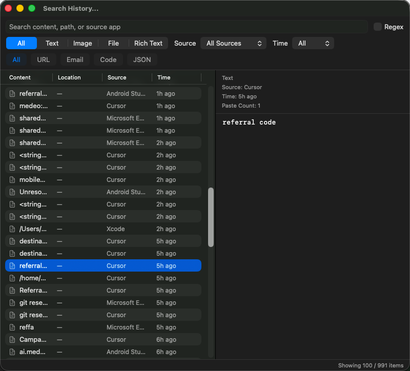

<div align="center">


# Clipy

**原生 macOS 菜单栏剪贴板管理 + 截图工具，并与手机端端到端加密局域网同步。**

剪贴板历史 · 片段与快捷键 · 截图标注与端侧 OCR · 全局搜索 ·
手机通知镜像 · AES-GCM 加密同步与文件传输

[中文](README_ZH.md) | [English](README.md)

[](https://github.com/JunWeiUp/Clipy/releases)
[](https://github.com/JunWeiUp/Clipy/actions/workflows/release.yml)
[](#-下载)
[](#-架构)
[](LICENSE)
[](https://github.com/JunWeiUp/Clipy/stargazers)

</div>

---

## ✨ 为什么选择 Clipy

Clipy 常驻菜单栏，悄悄增强你的剪贴板。除了保存你复制的每一条内容，它还内置了**带端侧 OCR 的完整截图与标注工具**、覆盖全部历史的**全局搜索**，以及**加密同步**——把 Android 手机的剪贴板、文件和通知实时镜像到 Mac。无需云端、无需账号，一切都在你的局域网内完成。

- 🔒 **隐私优先** —— 同步全程 **AES-GCM 256 位**加密，仅在局域网传输；历史可选静态加密，密钥存放在 macOS 钥匙串。
- ⚡ **原生轻量** —— macOS 端纯 Swift/AppKit（不占 Dock），移动端 Flutter。
- 🌍 **双语界面** —— 随时在中文与英文之间切换。

## 🖼️ 截图

<p align="center">
  
</p>

<p align="center"><sub>全局搜索（<kbd>⇧</kbd><kbd>⌘</kbd><kbd>F</kbd>）—— 正则、类型 / 来源 App / 日期筛选、结果排序。</sub></p>

> **截图标注工具**、**通知镜像** 的截图即将补充。

## 🚀 功能

### 📋 剪贴板历史
- 自动捕获**文本、RTF、HTML、PDF、图片、文件**。
- **SHA-256 去重** —— 重复复制会把内容重新置顶，而不是重复堆积。
- **文件感知** —— 显示源文件路径，并支持在 Finder 中定位。
- 可按 bundle id **排除指定 App**（密码管理器、钥匙串等）。
- 历史条数可配，菜单懒加载，内存占用极低。
- 历史媒体文件可选**静态加密**（密钥存于 macOS 钥匙串）。

### ✂️ 片段管理（macOS）
- 用**文件夹**组织常用文本/代码，支持拖拽排序。
- 每个片段/文件夹可绑定**全局快捷键**，内置快捷键录入器。
- 片段库支持 **XML 导入/导出**。

### 📸 截图与标注（macOS）
- 捕获模式：**区域 / 窗口 / 全屏 / 滚动长截图 / 屏幕录制（MP4 + GIF）**。
- **18 工具标注引擎**（移植自 [macshot](https://github.com/)），统一单全屏 OverlayView：画笔（压感 + 平滑）、直线、**6 种箭头**（曲线/虚线/手绘）、矩形、填充矩形、椭圆、**正片叠底荧光笔**、富文本（粗体/斜体/描边/背景）、自增**编号**、emoji/图片**图章**、**马赛克/模糊/纯色/擦除**遮挡、**放大镜**、**像素标尺**、**取色器**、**聚光灯**。
- 每工具**二级选项条** + 玻璃主工具条 + 颜色/emoji/字体/特效弹层。
- **美化**渐变包裹 + **图像特效**（亮度/对比度/饱和度/锐度）。
- **滚动长截图**带侧边实时预览（基于 Vision 的帧拼接）。
- **录屏**含系统音频 + 麦克风双轨、摄像头悬浮窗、鼠标点击高亮、按键显示。
- 基于 Apple Vision 的**端侧 OCR** + **二维码**；**自动遮挡**敏感信息；**Apple Translation** 翻译覆盖。
- **贴图到屏幕**（缩放/透明度/旋转/编辑）、**右下角浮动缩略图**反馈、**独立编辑器**窗口（裁剪/翻转/缩放）、另存为、复制。
- 保存目录可配、单键工具快捷键、全局快捷键。
- 完整本地化（英文 + 简体中文）。

### 🔍 全局搜索（macOS）
- 任意位置按 <kbd>⇧</kbd><kbd>⌘</kbd><kbd>F</kbd> 呼出。
- 支持**正则**，并可按**类型、来源 App、日期**筛选。
- 结果排序、多选、复制/粘贴，搜索结果中即可置顶。

### 🔄 加密局域网同步
- macOS 与 Android 之间全程 **AES-GCM 256 位**加密传输。
- 设备通过 **/24 子网扫描** 与 **手动 IP:端口** 互相发现（可跨 2.4G/5G 子网）—— 无需云端、无需账号。
- 剪贴板历史可靠投递（ack + 离线队列）。
- 稳健可靠：**离线对端队列**会在设备短暂断网后自动重投。
- 通过内容哈希**防止环路**，复制内容不会在设备间无限弹跳。

### 🔔 手机通知镜像（Android → macOS）
- 在 Mac 上直接查看 Android 手机的通知。
- **双向** dismiss 与一键清除；支持按 App **白名单**过滤。

### ⌨️ 全局快捷键 与 🌍 国际化
- 搜索、截图、每个片段均可绑定快捷键。
- 全平台中/英文界面；**跨平台** —— macOS 原生，Android 与 iOS 共用一套 Flutter 代码。

<details>
<summary><b>🔐 关于安全的说明</b></summary>

同步流量使用 **AES-GCM 256 位**加密，内容在局域网内是保密的。需要注意的是：当前的预共享密钥为固定值，并非按设备配对生成，因此对端认证依赖**用户手动勾选的授权设备列表**。简而言之：它保护的是你**发送了什么**，而你**接收谁**由你自己掌控。欢迎为「按设备配对协商密钥」提交贡献。
</details>

## ⬇️ 下载

前往 [**Releases**](https://github.com/JunWeiUp/Clipy/releases) 页面获取最新构建：

| 平台 | 产物 |
| --- | --- |
| macOS 13+ | `ClipyClone-macOS-v<version>.zip` |
| Android（64 位） | `ClipyClone-Android-arm64-v8a-v<version>.apk` |
| Android（32 位） | `ClipyClone-Android-armeabi-v7a-v<version>.apk` |
| iOS | 需自行从源码构建（Flutter） |

> 首次启动时，请在「系统设置 → 隐私与安全性」中授予**辅助功能**（粘贴模拟）、**屏幕录制**（截图）和**本地网络**（同步）权限。

## 🛠️ 从源码构建

### macOS（Swift / AppKit）
环境要求：**macOS 13+** 及 Xcode 命令行工具。

```bash
./build_macos_app.sh
```

脚本会生成 `clipy_macos/ClipyClone.app` 并安装到 `/Applications`。

### Android / iOS（Flutter）
环境要求：Flutter SDK 与 Android SDK。

```bash
cd clipy_android
flutter pub get
flutter build apk --debug      # Android
# flutter build ios             # iOS
```

Release 构建会生成 `armeabi-v7a` 与 `arm64-v8a` 两个分 ABI 的 APK。

## 🏗️ 架构

**macOS 应用** —— Swift + AppKit，原生菜单栏应用（`LSUIElement`，不占 Dock）：
- `MenuController` —— 状态栏菜单：历史、片段、设备与各项操作。
- `ClipboardManager` —— 剪贴板轮询、历史持久化、去重、同步分发。
- `SnippetManager` —— 文件夹、片段、快捷键、导入导出。
- `SyncManager` —— 子网/手动发现、带长度前缀的 TCP 同步（协议 v2）、AES-GCM 加密、可靠历史与通知投递。
- `Sources/Screenshot/` —— 完整的截图/录屏引擎（移植自 macshot）：统一 OverlayView、18 工具标注引擎、滚动长截图、录屏、美化/特效、OCR、贴图、浮动缩略图、编辑器窗口。由 `ScreenshotSessionCoordinator` 编排。
- `SearchWindow` —— 带筛选与排序的全局搜索。
- `NotificationManager` —— 手机通知镜像。
- `PreferencesManager`、`SettingsWindow`、`SnippetEditorWindow`、`LogWindow` —— 配置与编辑界面。

**Android/iOS 应用** —— Flutter/Dart：
- `lib/main.dart` —— Tab 化界面（历史、设置、日志、通知、传输）。
- `lib/clipboard_manager.dart` —— 剪贴板监听、历史、同步协调。
- `lib/sync_manager.dart` —— 子网/手动发现、TCP 同步 v2、加密、历史与通知投递。
- `lib/notification_manager.dart` —— `NotificationListenerService` 集成。

## 🔁 同步协议

Clipy 使用面向局域网的协议 v2 处理剪贴板历史与通知：

- **设备发现** —— `/24` TCP 端口扫描 + 手动 `IP:端口`（可跨子网 / 双频段）。
- **传输方式** —— 原生 TCP，每条 JSON 信封带 4 字节大端长度前缀（`v: 2`，单帧上限 2 MB）。
- **消息类型** —— `history`、`history.fetch`、`notif.post` / `dismiss` / `clear` / `ack`、`hello` / `welcome`、`ping` / `pong`、`ack`。
- **加密** —— AES-GCM 256 位（配置配对密钥时走 HKDF）。
- **授权** —— 仅向本机授权列表中的设备推送剪贴板/通知。
- **可靠投递** —— 历史帧需在落库成功后 `ack`；有界离线队列 + 端点缓存用于重连。
- **环路防止** —— 内容哈希避免重复广播。

完整线协议、无 UI 保活通道规则与代码地图见 [`docs/PROTOCOL.md`](docs/PROTOCOL.md)。

## 📁 项目结构

```
clipy_macos/Sources/      # macOS Swift/AppKit 源码
clipy_android/lib/        # Android 与 iOS 的 Flutter/Dart 源码
build_macos_app.sh        # macOS 应用包构建脚本
build_android_apk.sh      # Android 分 ABI APK 构建脚本
.github/workflows/        # Release CI
res/                      # README 图片资源
assets/                   # Logo 与应用图标
```

## 🤝 贡献

欢迎提交 Issue 和 Pull Request！较大的改动请先开 Issue 讨论。贡献代码：

1. Fork 仓库并创建功能分支。
2. 确保 macOS 应用可通过 `./build_macos_app.sh` 构建，和/或 Flutter 应用可通过 `flutter build apk` 构建。
3. 提交 Pull Request 描述你的改动。

## 📦 发布

推送版本标签时会自动构建并发布 Release：

```bash
git tag v1.1.0
git push origin v1.1.0
```

也可以在 GitHub Actions 中手动触发 `Release` workflow，并输入类似 `1.1.0` 的版本号。

## 📄 许可证

基于 [MIT License](LICENSE) 开源。

## ⭐ Star History

[](https://star-history.com/#JunWeiUp/Clipy&Date)

---

<div align="center">

如果 Clipy 帮到了你，欢迎给个 ⭐ —— 这能让更多人发现这个项目！

</div>
