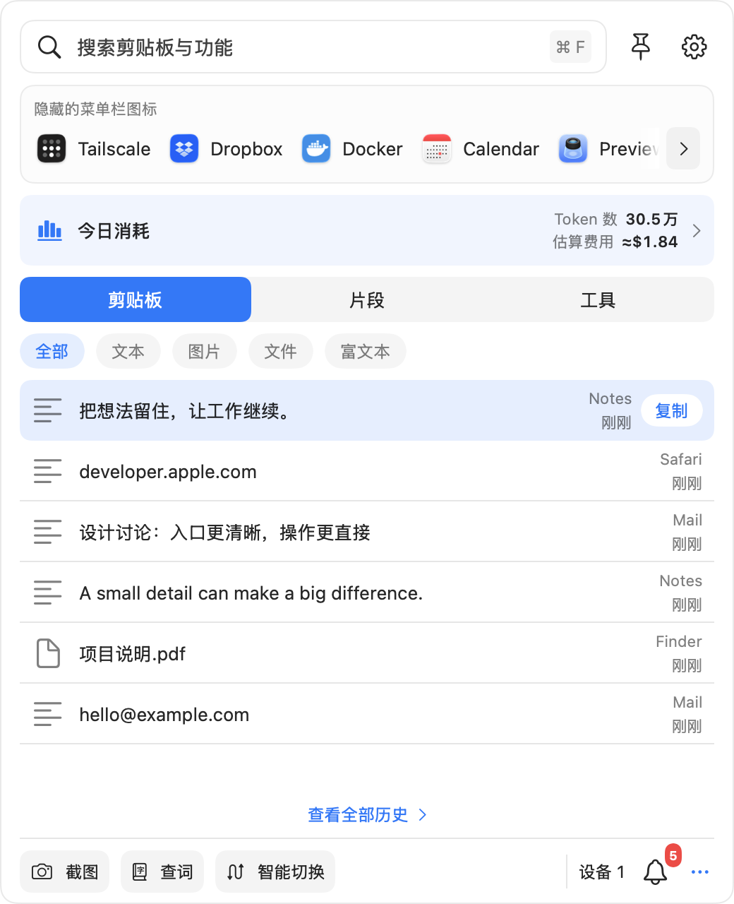
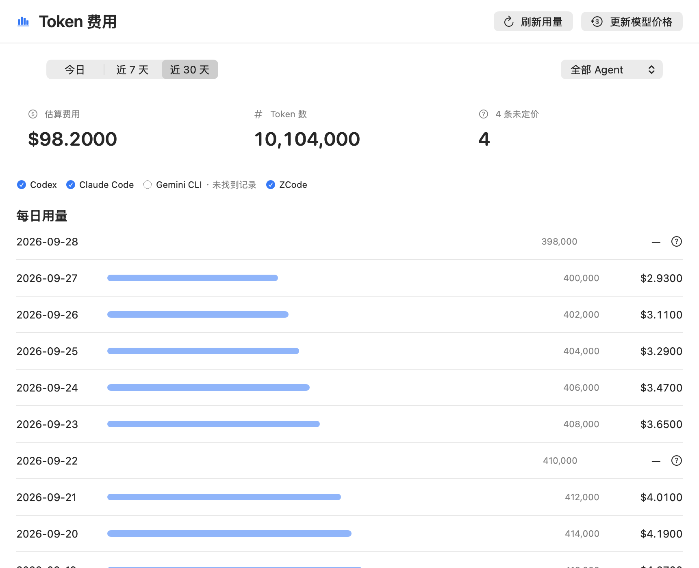

<div align="center">
  
  <h1>Clipy</h1>
  <h3>在这里复制，在那里继续。</h3>
  <p>记住复制过的内容，连接你的 Mac 与 Android。</p>
  <p><a href="README.md">English</a> · <strong>简体中文</strong></p>
  
  <br /><br />

**[下载 macOS 版 ↗](https://github.com/JunWeiUp/Clipy/releases/latest)** &nbsp;&nbsp; · &nbsp;&nbsp; **[下载 Android 版 ↗](https://github.com/JunWeiUp/Clipy/releases/latest)** &nbsp;&nbsp; · &nbsp;&nbsp; **[下载 Windows 版 ↗](https://github.com/JunWeiUp/Clipy/releases/latest)**

<sub>上方下载入口指向最新正式版 · macOS 13+ / Apple Silicon · Android arm64 · <a href="docs/GETTING_STARTED_ZH.md#下载与版本">其他安装包与安装说明</a></sub>

[](https://github.com/JunWeiUp/Clipy/releases)
[](https://github.com/JunWeiUp/Clipy/actions/workflows/ci.yml)
[](THIRD_PARTY_NOTICES.md)

**[看看界面](#从菜单栏开始)** · **[Android](#在-android-上也很顺手)** · **[开始使用](#三步开始使用)** · **[完整功能](#完整功能说明)**

</div>

<br />

<table>
<tr>
<td width="33%" valign="top">

### 复制过，就找得回。

刚才的链接、昨天的文字、临时复制的资料。留在历史里，需要时搜索一下。

</td>
<td width="33%" valign="top">

### 换台设备，接着用。

在可信局域网中共享剪贴板，互传文件。Mac 与 Android 连起来，无需注册账号。

</td>
<td width="33%" valign="top">

### 常用的话，少打一遍。

把回复和代码放进 Mac 片段库，分好文件夹，再配上快捷键。下次直接调用。

</td>
</tr>
</table>

## 从菜单栏开始

### 从菜单栏直接搜索。

Mac 悬浮窗顶部就是搜索，下方依次是隐藏的菜单栏图标、今日 Token 用量和最近复制。片段、工具与已连接设备也随手可达，无需让窗口常驻 Dock。

<p align="center"><a href="res/screenshots/macos-panel-zh.png"></a></p>

<table>
<tr>
<td width="50%" valign="top">

### 给剪贴板，多一点记忆。

按内容类型、来源应用和日期筛选，先看完整预览，再复制使用。

<a href="res/screenshots/macos-history-en.png"></a>

</td>
<td width="50%" valign="top">

### 写过的好内容，值得再用一次。

左边选文件夹，中间找片段，右边编辑正文。查找、修改和复制，在同一处完成。

<a href="res/screenshots/macos-snippets-en.png"></a>

</td>
</tr>
</table>

### 每天的 Agent 用量，一眼看清。

点击今日摘要打开原生「Token 费用」窗口，按天和模型查看用量。费用按模型标价估算，未知模型会保留 Token 数并标明未定价。

<p align="center"><a href="res/screenshots/macos-token-usage-zh.png"></a></p>

**看到的灵感，也能留下。** 在 Mac 上截图、标注、OCR 提取文字，或直接贴到屏幕上。还有滚动长截图、录屏和单词查询。[看看这些工具 ↓](#完整功能说明)

## 在 Android 上，也很顺手

重新设计的 **历史 · 设备 · 通知 · 设置** 四个入口。搜索保存的内容，选择要共享的设备，自由切换浅色、深色和系统外观。短动效衔接页面，保留浏览位置，复制完成后给出明确反馈。

<p align="center">
  <a href="res/screenshots/android-history-en.png"></a>&nbsp;
  <a href="res/screenshots/android-devices-en.png"></a>&nbsp;
  <a href="res/screenshots/android-settings-dark-en.png"></a>
</p>

<sub>Mac 悬浮窗与 Token 费用图片为使用虚构数据生成的源码构建原生截图；历史、片段和设置展示图经过装饰处理，点击可看原始捕获。Android 截图来自独立模拟器，顶部为概念插画。[图片来源与制作说明](res/screenshots/README.md)</sub>

<details>
<summary><b>再看一个细节：顺着浏览习惯的偏好设置</b></summary>

连续滚动浏览 Mac 设置，也可从侧边栏直接跳到对应分类。

<a href="res/screenshots/macos-preferences-en.png"></a>

</details>

## 三步开始使用

1. **安装 Clipy。** Mac 解压后移入「应用程序」，Android 安装 APK。Mac 端入口在菜单栏。详见[安装指南](docs/GETTING_STARTED_ZH.md)与 [macOS 首次启动说明](docs/MACOS_INSTALL.md)。
2. **复制一段想留下的内容。** Android 首次测试时保持 Clipy 打开；在 Mac 上按 <kbd>⇧</kbd> <kbd>⌘</kbd> <kbd>F</kbd> 搜索历史。
3. **连接你的设备。** 连到同一个可信 Wi-Fi，设置相同的私有配对密钥，再开启向目标设备的共享。[按步骤连接](docs/GETTING_STARTED_ZH.md#连接-mac-与-android)。

**[安装与常见问题](docs/GETTING_STARTED_ZH.md)** · **[反馈问题](https://github.com/JunWeiUp/Clipy/issues/new?template=bug_report.yml)** · **[建议新功能](https://github.com/JunWeiUp/Clipy/issues/new?template=feature_request.yml)**

> **开始共享前：** 同步面向可信局域网，请设置足够强的私有配对密钥，并了解[安全边界](SECURITY.md)。macshot 截图移植模块仍需完成[第三方许可核对](THIRD_PARTY_NOTICES.md)，不能将整个组合应用直接视为仅受 MIT 许可约束。

<details>
<summary><b>版本、下载与源码构建</b></summary>

当前源码版本：**1.0.23** · 默认本地构建号 **10136** · [构建版本配置](clipy_android/pubspec.yaml)

安装包请前往[最新正式版](https://github.com/JunWeiUp/Clipy/releases/latest)，具体应用版本和构建号以发布说明为准。Android 改版已在 v1.0.19 发布；准备新版期间，上方源码版本可能领先于公开安装包。Release 徽章只显示公开版本，不包含草稿。旧版升级请阅读[同步版本差异](docs/GETTING_STARTED_ZH.md#同步版本差异)。

</details>

## 完整功能说明

<details>
<summary><b>展开剪贴板、截图、同步与通知功能</b></summary>

### 📋 剪贴板历史
- 自动捕获**文本、RTF、HTML、PDF、图片、文件**。
- **SHA-256 去重** —— 重复复制会把内容重新置顶，而不是重复堆积。
- **文件感知** —— 显示源文件路径，并支持在 Finder 中定位。
- 可按 bundle id **排除指定 App**（密码管理器、钥匙串等）。
- 历史条数可配，菜单懒加载，内存占用极低。
- 历史媒体文件可选**静态加密**（密钥保存在仅所有者可读写的本地文件中，详见[安全说明](SECURITY.md)）。

### ✂️ 片段管理（macOS）
- 用**文件夹**组织常用文本/代码，支持拖拽排序。
- 每个片段/文件夹可绑定**全局快捷键**，内置快捷键录入器。
- 片段库支持 **XML 导入/导出**。

### 📸 截图与标注（macOS）
- 捕获模式：**区域 / 窗口 / 全屏 / 滚动长截图 / 屏幕录制（MP4 + GIF）**。
- **18 工具标注引擎**（移植自 [macshot](https://github.com/sw33tLie/macshot)），统一单全屏 OverlayView：画笔（压感 + 平滑）、直线、**6 种箭头**（曲线/虚线/手绘）、矩形、填充矩形、椭圆、**正片叠底荧光笔**、富文本（粗体/斜体/描边/背景）、自增**编号**、emoji/图片**图章**、**马赛克/模糊/纯色/擦除**遮挡、**放大镜**、**像素标尺**、**取色器**、**聚光灯**。
- 每工具**二级选项条** + 玻璃主工具条 + 颜色/emoji/字体/特效弹层。
- **美化**渐变包裹 + **图像特效**（亮度/对比度/饱和度/锐度）。
- **滚动长截图**带侧边实时预览（基于 Vision 的帧拼接）。
- **录屏**含系统音频 + 麦克风双轨、摄像头悬浮窗、鼠标点击高亮、按键显示。
- 基于 Apple Vision 的**端侧 OCR** + **二维码**；**自动遮挡**敏感信息；**Apple Translation** 翻译覆盖。
- **贴图到屏幕**（缩放/透明度/旋转/编辑）、**右下角浮动缩略图**反馈、**独立编辑器**窗口（裁剪/翻转/缩放）、另存为、复制。
- 保存目录可配、单键工具快捷键、全局快捷键。
- 完整本地化（英文 + 简体中文）。

### 🔍 全局搜索（macOS）
- 任意位置按 <kbd>⇧</kbd><kbd>⌘</kbd><kbd>F</kbd> 呼出。
- 支持**正则**，并可按**类型、来源 App、日期**筛选。
- 结果排序、多选、复制/粘贴，搜索结果中即可置顶。

### 🗣️ 智能切换应用（macOS）

- 按 <kbd>⌃</kbd><kbd>⌥</kbd><kbd>A</kbd>，或从菜单栏选择**智能切换应用**。输入框自动聚焦并切到已启用的豆包输入法；自行启动豆包语音输入或直接打字，再按回车执行。中文组词时回车先确认候选；Esc 先取消组词，未组词时关闭窗口并将当前文字粘贴回原应用。空内容只关闭；点击关闭按钮也只关闭。原应用不可用时，文字保留在剪贴板。
- 在**偏好设置 → 智能切换**添加应用，设置名称、别名和用途描述，例如“浏览器、查资料”或“日常写代码的编辑器”。目标明确时切到已运行应用或启动应用；有多个候选时用上下方向键和回车选择。应用丢失时可重新定位，快捷键支持修改、禁用和清除。
- **打开应用优先：** 智能模式先在本地识别“打开 ZCode 软件”等明确指令，按已启用应用的名称和别名匹配。唯一匹配直接启动或切换，不等模型；歧义时列出候选。“打开 ZCode 并新建对话”会保留新对话操作。
- **六个按钮全部显示：** 智能识别、打开应用、ZCode 新对话、打开 Codex、搜索网页、翻译。ZCode 新对话会创建无项目对话并带入当前完整文字，输入为空时打开空白对话；只预填，不自动发送。打开 Codex 会启动或激活本机应用，无需模型配置。
- **滚轮循环切换：** 所有功能以两行直接显示，不分页、不藏在菜单里。鼠标放在按钮区域，滚轮双向首尾循环选择，回车执行；点击按钮在具备所需输入时直接执行。正文和结果区仍正常滚动。设置中可调整按钮顺序、搜索引擎和翻译语言。 网页搜索默认使用 Google。
- **翻译结果：** 模型输出直接显示在“智能切换应用”标题下方，长内容在独立区域内滚动，功能按钮始终可见。支持复制、继续处理或粘贴回原应用；显示结果时，Esc 优先回贴该结果。语义判断和翻译需要模型配置；明确的应用匹配、打开 Codex 和 ZCode 新对话不依赖模型。
- 配置兼容 Chat Completions 的 **Base URL**（包含 `/v1` 等版本路径，不含 `/chat/completions`）、**模型名称**和 **API Key**，测试连接后保存。应用列表和 API 配置初始为空；清空三项 API 字段后保存可移除服务配置。
- 模型动作只发送本次输入、可用动作 ID，以及已启用应用的名称、别名、用途描述和选择 ID；翻译会发送你选择处理的文字。不上传路径或剪贴板历史。密钥保存在 macOS 钥匙串；Clipy 不录音、不执行模型生成的命令。修改文字、切换功能或关闭窗口会取消待处理结果。
- **语音自动入口（需开启）：** 在偏好设置 → 智能切换中开启，并选择与豆包「长按模式」相同的按键（默认右侧 Command，也支持右侧 Option 和 Fn）。所有应用采用同一规则：确认输入框或无法确认焦点时，保留普通豆包语音；只有确认非输入控件（如实际聚焦的按钮、已确认的桌面）才自动打开输入窗口。仅有窗口、分组、网页容器信息不代表非输入。按下时读取新焦点，长按到期后复核同一目标；探测和有限重试共用总时限。超时、证据冲突、迟到结果不能抢回已经交给豆包的这次手势。自绘编辑器信息不足时，仍可用智能切换快捷键手动呼出。说话、松手、文字落入后按回车；关闭后返回原应用。密码安全输入、短按和组合键保持原行为。需要「辅助功能」和「输入监控」权限，授权后重启 ClipyClone。暂不接管免按模式或语音按钮，也不会根据文字暂停猜测语音已经结束。

- 输入窗采用不激活应用的面板：接收文字和语音时保持原应用在前台，避免外设工具因短暂切到 Clipy 而更换应用预设。执行应用动作前会释放输入焦点；Esc 仍可回贴到原应用。
- 长按已触发弹窗后，提前松键、外设预设切换或输入准备失败，只中止本次语音转交，保留窗口供再次长按或打字；Esc、关闭按钮和成功执行仍按原规则关闭。

### 📖 单词查询（macOS）
- 从剪贴板菜单栏进入，或按 <kbd>⌃</kbd><kbd>⌥</kbd><kbd>D</kbd> 打开；可在偏好设置中修改或关闭快捷键。
- 支持中文、英文及部分文字查询：中文查询列出英文译词，中英文联想与英文拼写建议可点击查看完整词条。英文词条包含中文释义、词性、美式音标、词形变化、相关短语与双语例句；点击短语可继续查询。
- 支持英文短语、整句译中文，以及中文句子译英文，允许标点和数字（最多 500 字符）。`Fine-grained personal` 等未收录短语会显示独立的机器翻译，支持复制译文和朗读英文。将内容粘贴到输入框后点击**查询**或按 <kbd>⌘</kbd> + <kbd>Return</kbd> 提交；句子翻译不加入单词表。
- 支持美式发音播放；词典音频不可用时使用已安装的系统美式英语语音。词典缺少音标、短语或例句时会明确提示。
- 打开窗口时，若剪贴板内容是单个英文单词，会自动填入并聚焦输入框，按回车即可查询；句子、网址、文件和多个单词不会自动填入。仅在确认提交后联网查询有道词典，完整词条自动保存到本机单词表；关闭窗口即取消请求、停止发音并释放结果。
- 从菜单栏或查词窗口打开**单词表**，在**不熟悉 / 熟悉**两个列表中复习；勾选即标记熟悉，取消勾选移回不熟悉。支持中英文模糊搜索（部分文字、跳字、混合关键词及英文拼写容错），覆盖单词、释义、词形、短语与例句；离线查看已保存的音标、释义、词形、短语与例句，联网播放词典发音（不可用时回退系统语音）。重复查询更新词条和查询次数，保留熟悉状态。单词表仅保存在这台 Mac，不参与同步；旧版本未保留查询记录，无法补回此前查过的单词。
- 单词表支持一键显示／隐藏中文释义，同时切换列表摘要、详情释义、短语翻译和例句翻译；会记住上次选择，关闭窗口或重启应用后仍然生效。独立查词窗口继续显示完整释义。
- 使用无需 API Key 的有道网页词典接口，非有版本保障的公开 API，接口可能变化或暂时不可用；结果附词典来源链接。

### 💰 每日 Token 用量（macOS 源码构建）
- 点击菜单栏图标后，悬浮面板在隐藏菜单栏图标下方直接显示今日 Token 数与估算费用；点击摘要可打开「Token 费用」窗口，按天、模型、近 1／7／30 天和 Agent 查看明细。右键经典菜单也提供入口。
- 打开浮层或统计窗口时读取 Codex、Claude Code、Gemini CLI 与 ZCode 已有的本地用量元数据，首次导入现有历史，之后增量刷新；也可手动刷新。本机只保存用量字段和文件路径哈希游标，不安装 hook、不常驻轮询、不保存提示词、回复或原始来源路径，也不将用量同步到 Android。首版暂不包含 Cursor。
- 美元金额按内置模型标价**估算，不是订阅账单或实际扣费**。未知模型保留 Token 数并标为未定价，不显示成 0 美元。「更新模型价格」仅在用户点击时下载 [LiteLLM 价格数据](https://github.com/BerriAI/litellm/blob/main/model_prices_and_context_window.json)；平时可离线查看。

### 🔄 加密局域网同步
- macOS 与 Android 之间全程 **AES-GCM 256 位**加密传输。
- 设备通过 **/24 子网扫描** 与 **手动 IP:端口** 互相发现（可跨 2.4G/5G 子网）—— 无需云端、无需账号。
- 剪贴板历史可靠投递（ack + 离线队列）。
- **Mac 之间发送文件夹**：在设备菜单选择**发送文件或文件夹…**。新版 Mac 会自动还原到 `~/Downloads/Clipy/`，保留子目录、空目录及隐藏文件；同名时自动另存。两台 Mac 都需包含本次文件夹传输更新才能自动还原；旧版 Mac 和 Android 收到普通 ZIP。单次文件夹含打包开销上限为 **512 MiB / 10,000 个项目**；符号链接及特殊文件会拒绝发送。
- 稳健可靠：**离线对端队列**会在设备短暂断网后自动重投。
- 通过内容哈希**防止环路**，复制内容不会在设备间无限弹跳。

### 🔔 手机通知镜像（Android → macOS）
- 在 Mac 上直接查看 Android 手机的通知。
- **双向** dismiss 与一键清除；支持按 App **白名单**过滤。

### macOS 界面
- **隐藏的菜单栏图标（源码构建）：** 在偏好设置 → 通用或浮层设置中开启。单个内置屏幕上，被挤掉的项目直接显示在搜索框下方的图标栏中，优先显示原图，截取失败时显示应用图标和名称。点击通过辅助功能请求打开原菜单，部分应用可能不支持；不移动图标。需要辅助功能权限；屏幕录制权限仅用于原图预览（macOS 14+），并非必需。不保证动态图标内容复现；连接外屏时暂停。
- 原生标题栏、清晰的浅色/深色内容背景，以及统一的 SF Symbols、间距与控件样式。
- 按 <kbd>Esc</kbd> 关闭当前聚焦的窗口，包括设置、搜索、查词、单词表、片段及图片／视频编辑器、OCR 结果和贴图；保留原有保存提示，输入法组词、快捷键录入和模态对话框优先处理取消操作。
- **轻量控制面板（源码构建）：** 左键点击菜单栏图标，打开原生浮层，顶部一行包含搜索、置顶和设置，下面是直出的隐藏图标、今日 Token 用量估算、「剪贴板 / 片段 / 工具」标签，以及设备和通知页面。搜索异步覆盖历史、片段与工具，首页展示最近六条复制内容；点击历史行会复制并粘贴支持的文本类型，行内「复制」按钮只复制并保持浮层打开。可固定面板，点击外部不关闭；右键菜单栏图标仍可打开经典原生菜单。上方展示的是当前源码构建，公开安装包可能不同。
- 偏好设置与截图设置可连续滚动浏览各类选项，侧边分类随滚动高亮，也支持点击跳转。界面开发规范见 [macOS 设计标准](docs/MACOS_DESIGN.md)。

### ⌨️ 全局快捷键 与 🌍 国际化
- 搜索、单词查询、智能切换应用、截图、每个片段均可绑定快捷键。
- 中/英文界面；macOS 使用原生实现，Android、Windows 和 iOS 源码目标使用 Flutter。Windows 新增本机文字／图片／文件历史与系统托盘；iOS 支持用户主动粘贴及前台局域网同步，不能在后台持续读取其他应用的剪贴板或通知。CI 对 iOS 进行无签名构建，目前没有可安装的 iOS 发布包。

<details>
<summary><b>🔐 关于安全的说明</b></summary>

请只在可信网络中启用同步，并配置足够强的私有配对密钥。未设置配对密钥时同步保持暂停，不再有内置兜底密钥；可在 Mac 上生成配对码，用 Android 相机扫描二维码导入，或在各设备手动输入。授权设备列表不是密码学身份认证，单次文本与文件发送也有不同的授权规则。完整说明见 [SECURITY.md](SECURITY.md)。
</details>

</details>

<details>
<summary><b>开发者文档：构建、架构与同步协议</b></summary>

## 🛠️ 从源码构建

以下命令均在仓库根目录执行。如果网络需要代理，请先启用自己的终端代理配置（已配置 `proxy` 命令的本机可先执行 `proxy`）；构建脚本本身不依赖特定代理命令。

macOS、Android 和 iOS 的应用图标使用同一份设计母版。更新各平台尺寸及 README 标志的方法见[图标资源与导出说明](assets/branding/README.md)。

### macOS（Swift / AppKit）

环境要求：**Xcode 26+** 和 macOS 26 SDK；应用最低部署版本仍为 macOS 13。

```bash
./build_macos_app.sh
```

产物为 `clipy_macos/ClipyClone.app` 和 `clipy_macos/ClipyClone.app.dSYM`，默认**不安装、不启动**。如需构建后安装到 `/Applications` 并自动启动，请先退出正在运行的 Clipy，再执行：

```bash
INSTALL_APP=1 LAUNCH_APP=1 ./build_macos_app.sh
```

本地 macOS 构建使用 ad-hoc 签名，不含 Developer ID 签名或公证。详见[构建与签名选项](docs/DEVELOPMENT.md#macos)。

**在 GitHub 打包：**打开 [Actions → macOS Build](https://github.com/JunWeiUp/Clipy/actions/workflows/macos.yml)，点击 **Run workflow**，即可单独构建 Mac 应用，无需签名密钥或 Android 配置。推送到 `main`/`master` 和提交涉及 macOS 的 PR 时，CI 也会调用同一 Mac 任务。

Mac 任务成功后，从运行摘要下载 artifact（需登录 GitHub，保留 30 天），其中只包含 **Apple Silicon / macOS 13+** 应用 ZIP；运行摘要提供安装指南链接，打包步骤会输出 SHA-256 摘要。

这些是临时签名的开发构建，不代表已正式发布；首次打开的「**隐私与安全 → 仍要打开**」操作和更新后授权说明见[安装指南](docs/MACOS_INSTALL.md)。完成发布清单后，版本标签会触发三个平台的正式发布。

### Android（Flutter）

环境要求：Flutter **3.41.7**（见 `.fvmrc`）、JDK 17 与 Android SDK。

每台构建机器首次使用时，需按 [Android 签名指南](docs/DEVELOPMENT.md#android)配置固定发布密钥，使用 Git 忽略的 `clipy_android/android/key.properties` 或签名环境变量。配置完成后，直接运行：

```bash
./build_android_apk.sh
```

产物为 `dist/ClipyClone-Android-arm64-v8a-v<version>.apk` 和 `dist/ClipyClone-Android-armeabi-v7a-v<version>.apk`。脚本会解析锁定的依赖并使用已配置的密钥签名两个 Release APK；GitHub Release 只提供 arm64 APK。后续升级须保留同一份密钥，切勿提交签名文件或密码。

如果只需调试包，无需配置发布签名：

```bash
(
  cd clipy_android
  flutter pub get --enforce-lockfile
  flutter build apk --debug --no-pub
)
```

调试包位于 `clipy_android/build/app/outputs/flutter-apk/app-debug.apk`。调试包与发布包签名不同，不能假设可互相覆盖安装；如确需卸载重装，请先备份应用数据。

### Windows（Flutter + Win32）

在 Windows 10/11 x64 上安装 Flutter **3.41.7** 和 Visual Studio 的「使用 C++ 的桌面开发」工作负载后构建：

```powershell
cd clipy_android
flutter pub get --enforce-lockfile
flutter build windows --release --no-pub -t lib/main_windows.dart
cd ..
./scripts/package_windows.ps1 -Version 1.0.23
```

产物为 `dist/ClipyClone-Windows-x64-v1.0.23.zip`。完整解压后运行 `ClipyClone.exe`；关闭主窗口后仍在系统托盘继续记录和同步，托盘菜单的「退出」才会结束进程。文字可向已授权设备自动同步；复制的图片和文件保留在本机历史，文件传输需显式发起。当前源码构建在「历史记录」增加「截图」菜单，支持区域、窗口和显示器截图；完成后复制 PNG 并保存到本机历史。窗口截图使用 Windows `PrintWindow`：目标应用可能拒绝捕获，也可能返回空白画面，受保护或使用 GPU 绘制的内容尤其需要实机检查。设置中可按剪贴板来源程序名排除应用；能识别来源进程时默认排除常见密码管理器。Windows 源码构建与正式版 ZIP 均未签名；公开版本以发布页为准。

### iOS（Flutter + Swift）

iOS 15+ 目标已纳入 CI 无签名构建，目前不提供 IPA 或 TestFlight 下载。支持查看本地历史、通过系统粘贴按钮主动导入文字、前台同步、文件收发及查看 Android 镜像通知。iOS 限制后台持续运行和读取其他应用通知；公开分发前仍需签名真机验证权限与同步。

### 版本号与检查

两个根目录构建脚本默认读取 [`clipy_android/pubspec.yaml`](clipy_android/pubspec.yaml) 中的 `version: X.Y.Z+N`：`X.Y.Z` 为应用版本，`N` 为构建号；也可通过 `APP_VERSION`、`BUILD_NUMBER` 显式覆盖单次构建。版本变更时应在同一批改动中同步更新**中英文两份 README**，并保持构建号递增；若要覆盖更高构建号的 CI 包，本地需使用更高的 `BUILD_NUMBER`。

Release 构建号为源码构建号加 Release 工作流运行序号。如需用本地构建覆盖已发布的 Android APK，须保留相同签名密钥，并将 `BUILD_NUMBER` 设为高于已安装包的值；同一应用版本的默认本地构建号可能低于 CI 安装包。

在仓库根目录运行 `bash scripts/check.sh all` 可执行质量检查。macOS 上还需运行 `bash scripts/test_macos_core.sh`，验证搜索、单词查询、智能切换应用与 socket 回归用例；它使用临时测试程序，不安装或启动应用。智能切换测试使用模拟 API 响应，无需密钥，也不会激活真实应用。

可选运行 `CLIPY_MENU_BAR_LIVE_TESTS=1 bash scripts/test_macos_core.sh`，在单个内置屏幕、已有辅助功能权限的环境中创建临时溢出图标，验证原生菜单和弹窗能否打开；不会安装应用或移动现有图标。

## 🏗️ 架构

**macOS 应用** —— Swift + AppKit，原生菜单栏应用（`LSUIElement`，不占 Dock）：
- `MenuController` —— 状态栏菜单：历史、片段、设备与各项操作。
- `Sources/MenuBarOverflow/` —— 可选的隐藏菜单栏项目发现、图标预览和辅助功能操作；仅本机使用，不调整图标顺序。
- `ClipboardManager` —— 剪贴板轮询、历史持久化、去重、同步分发。
- `SnippetManager` —— 文件夹、片段、快捷键、导入导出。
- `SyncManager` —— 子网/手动发现、带长度前缀的 TCP 同步（协议 v2）、AES-GCM 加密、可靠历史与通知投递。
- `Sources/Screenshot/` —— 完整的截图/录屏引擎（移植自 macshot）：统一 OverlayView、18 工具标注引擎、滚动长截图、录屏、美化/特效、OCR、贴图、浮动缩略图、编辑器窗口。由 `ScreenshotSessionCoordinator` 编排。
- `SearchWindow` —— 带筛选与排序的全局搜索。
- `NotificationManager` —— 手机通知镜像。
- `PreferencesManager`、`SettingsWindow`、`SnippetEditorWindow`、`LogWindow` —— 配置与编辑界面。

**Android/iOS 应用** —— Flutter/Dart：
- `lib/main.dart` —— 默认入口；`lib/app/` 负责初始化与无界面引擎桥接。
- `lib/features/` —— 设备、历史、设置、日志与文件页面。
- `lib/clipboard_manager.dart` —— 剪贴板监听、历史、同步协调。
- `lib/sync_manager.dart` —— 子网/手动发现、TCP 同步 v2、加密、历史与通知投递。
- `lib/notification_manager.dart` —— `NotificationListenerService` 集成。

## 🔁 同步协议

Clipy 使用面向局域网的协议 v2 处理剪贴板历史与通知：

- **设备发现** —— `/24` TCP 端口扫描 + 手动 `IP:端口`（可跨子网 / 双频段）。
- **传输方式** —— 原生 TCP，每条 JSON 信封带 4 字节大端长度前缀（`v: 2`，单帧上限 2 MB）。
- **消息类型** —— `history`、`history.fetch`、`notif.post` / `dismiss` / `clear` / `ack`、`hello` / `welcome`、`ping` / `pong`、`ack`。
- **加密** —— AES-GCM 256 位（配置配对密钥时走 HKDF）。
- **授权** —— 仅向本机授权列表中的设备推送剪贴板/通知。
- **可靠投递** —— 历史帧需在落库成功后 `ack`；有界离线队列 + 端点缓存用于重连。
- **环路防止** —— 内容哈希避免重复广播。

完整线协议、无 UI 保活通道规则与代码地图见 [`docs/PROTOCOL.md`](docs/PROTOCOL.md)。

## 📁 项目结构

```
clipy_macos/Sources/      # macOS Swift/AppKit 源码
clipy_android/lib/        # Android 与 iOS 的 Flutter/Dart 源码
build_macos_app.sh        # macOS 应用包构建脚本
build_android_apk.sh      # Android 分 ABI APK 构建脚本
.github/workflows/        # CI + 三平台正式发布
res/                      # README 图片资源
assets/                   # Logo 与应用图标
```

</details>

## 🤝 贡献

欢迎用中文或英文提交 Issue 和 Pull Request！先阅读[贡献规范](CONTRIBUTING.md)、[架构地图](docs/ARCHITECTURE.md)与[修改指引](docs/AI_CHANGE_GUIDE.md)。贡献代码：

1. Fork 仓库并创建功能分支。
2. 运行 `bash scripts/check.sh all`，并构建受影响的原生平台。
3. 提交 Pull Request 描述你的改动。

## 📦 发布

完成[发布清单](docs/DEVELOPMENT.md#release-checklist)、配置发布签名并更新 `clipy_android/pubspec.yaml` 和中英文 README 后提交改动，再推送与源码版本一致的**全新、未使用过的版本标签**。所有检查通过后，工作流会直接发布正式版：

```bash
VERSION="$(awk '/^version:/ {split($2, v, "+"); print v[1]; exit}' clipy_android/pubspec.yaml)"
git tag "v${VERSION}"
git push origin "v${VERSION}"
```

也可以手动触发 `Release` workflow，并输入与源码一致的 `X.Y.Z` 版本号。两种触发方式都会直接公开发布，请提前完成清单；不要移动或覆盖已有版本标签。

工作流发布正式最新版，只上传三个安装包：macOS ZIP、Android arm64 APK 和 Windows x64 ZIP。GitHub 在每个附件旁显示 SHA-256 摘要，不再单独上传校验清单、符号包、许可或声明文件；macOS 应用与 Windows ZIP 内已有项目许可和声明。GitHub 另行自动生成源码压缩包。发布后检查附件链接，并同步更新中英文 README 和两份入门指南中的已发布版本。详见 [GitHub 发布说明](https://docs.github.com/en/repositories/releasing-projects-on-github/managing-releases-in-a-repository)。

可使用[更新说明模板](docs/RELEASE_NOTES_TEMPLATE.md)，说明用户可见的变化、升级步骤与实际提供的平台版本。

## 📄 许可证

仓库目前保留 [MIT License](LICENSE) 文本，但 macshot 移植模块仍需单独核对许可与来源，不能将整个组合应用直接视为仅受 MIT 许可约束。详见 [THIRD_PARTY_NOTICES.md](THIRD_PARTY_NOTICES.md)。

## ⭐ Star History

[](https://star-history.com/#JunWeiUp/Clipy&Date)

---

<div align="center">

如果 Clipy 帮到了你，欢迎给个 ⭐ —— 这能让更多人发现这个项目！

</div>
