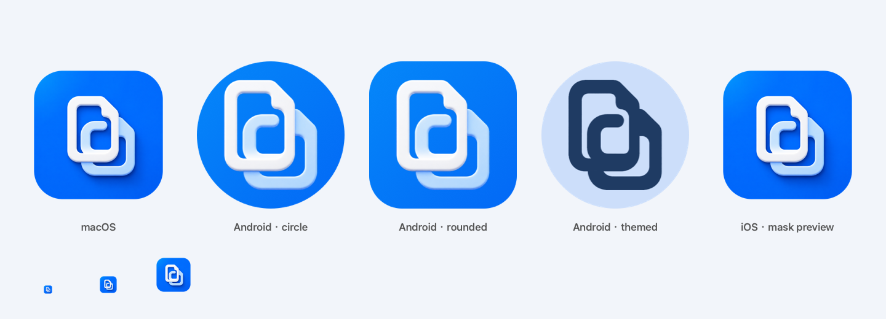

# Clipy app icon

The redesigned mark combines two interlocking document outlines to represent
clipboard history, copying and cross-device connection. It retains Clipy's
blue-and-white palette, with no text inside the icon so it remains legible at
small sizes.

## Canonical artwork

- `icon-master.png`: opaque, square, full-bleed artwork generated with the built-in
  image generation tool. Keep this original intact when exporting platform sizes.
- The macOS menu-bar symbol is a separate monochrome system symbol; it is not a
  launcher icon and should continue adapting to the menu bar's appearance.

## Platform exports

The checked-in exports are used directly by normal builds; no image-generation
service, API key or additional package is required to build Clipy.

| Target | Resource | Treatment |
| --- | --- | --- |
| macOS | `Clipy/Resources/AppIcon.png` | 1024 px RGBA, rounded tile with transparent padding; the build creates the `.icns` sizes |
| Android < 8 | `mipmap-{mdpi,hdpi,xhdpi,xxhdpi,xxxhdpi}/ic_launcher.png` | 48/72/96/144/192 px legacy launcher icons |
| Android 8+ | `mipmap-anydpi-v26/ic_launcher.xml` | Independent blue background and transparent foreground; system-applied mask |
| Android 13+ | `mipmap-anydpi-v33/ic_launcher.xml` | Adds a white alpha silhouette for launcher-themed icons |
| iOS | `clipy_android/ios/Runner/Assets.xcassets/AppIcon.appiconset/` | 15 opaque RGB sizes from `Contents.json`, no baked mask or padding |
| Documentation | `Logo.png` | 512 px rounded transparent tile used by both root README files |

Android paths above are relative to `clipy_android/android/app/src/main/res/`.
The foreground layers are 432 px at xxxhdpi (108 dp); the 54 dp tall mark is
centered and checked against the 66 dp safe circle. The system is free to apply
circle, rounded-square or other masks. See the official
[Android adaptive icon guidance](https://developer.android.com/develop/ui/compose/system/icon_design_adaptive).
Notification status icons and the macOS menu-bar symbol retain their separate
monochrome, functional artwork.

## Regenerate and validate

From the repository root on macOS with Xcode's Swift tools:

```bash
swift scripts/export_app_icons.swift
python3 scripts/check_icons.py
```

The exporter uses only macOS system frameworks (CoreGraphics, ImageIO, AppKit).
It preserves the approved master and deterministically applies platform framing,
resizing and a color matte for Android. **The matte thresholds are specific to
this blue-and-white master**; review the extraction and safe area if the design
changes. Do not use a flattened checkerboard image as transparent artwork.

Review `icon-preview.png` after exporting, including the 16/32/64 px samples,
then rebuild the applications. The preview uses representative masks, not device
screenshots; actual Android masks/theme colors vary by launcher. The unused legacy
`assets/logo/logo_placeholder.png` is also refreshed to avoid retaining old branding.

The portable Python check uses only the standard library and runs as part of
`bash scripts/check.sh repo`. It checks PNG dimensions/color modes, transparent
corners, Android safe area and themed silhouette, adaptive XML wiring, and every
iOS catalogue entry. Icon asset validation does not establish that the experimental
iOS application's native features work.



## Generation prompt

Tool: built-in `image_gen` (not the API/CLI fallback).

```text
Use case: logo-brand.
Asset type: production-ready square app icon for Clipy, a native macOS clipboard-history utility with Android LAN synchronization.
Primary request: completely redesign the existing icon into an original, exceptionally polished, simple and memorable app symbol. Retain the brand's established blue-and-white family. NO typography.
Subject: exactly two interlocking, softly rounded document-card contours, offset slightly diagonally, whose shared negative space creates one bold open-C / bent-paperclip silhouette. This must feel like a single coherent copy-and-connect mark, not several separate icons. A porcelain-white front contour and a subtly ice-blue rear contour, with substantial stroke weight and large clean negative spaces so the silhouette remains legible at 32 pixels. Broad rounded terminals. No internal text lines. A refined tactile 2.5D treatment: very shallow extruded depth, satin ceramic surfaces, restrained bevels and soft contact shadows, crisp precision edges.
Scene/backdrop: saturated rich cobalt/azure blue square background, gently lit from upper left; restrained tonal depth, no rainbow or purple gradient. Background fills the entire square to every edge, no surrounding canvas, no rounded exterior corners, no external shadow, no transparency. The operating system will apply icon masking.
Composition: single front-facing icon, straight-on orthographic view, mathematically balanced and optically centered, the complete white-and-ice-blue mark contained inside the central 58% of the canvas, generous clear margins, no parts near the edge. Square 1024 x 1024 or larger.
Style: contemporary premium macOS utility icon, minimal and calm, carefully sculpted rather than toy-like. A beautiful strong silhouette that is recognizable without lettering.
Constraints: one icon only, no contact sheet, no presentation board, no phone/computer mockup, no text, no letters printed on the icon, no watermark, no sync arrows, no orbit rings, no circles around the symbol, no sparkles, no tiny decorative details, no photorealistic environment. Do not reproduce another company's logo.
```
