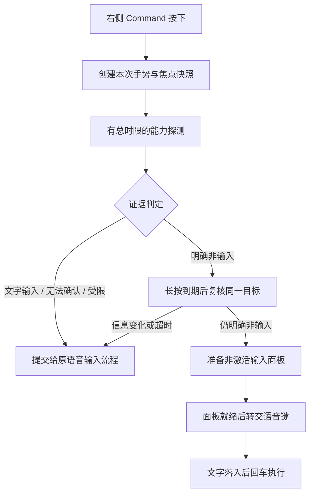

# 智能切换：跨应用语音入口统一方案

状态：第一阶段统一入口已实现并通过完整自动化回归；第二阶段回贴目标保护已实现，真实应用矩阵仍待实测。本方案保留豆包转写、右侧 Command 长按、明确应用指令优先及手动智能切换入口。

## 1. 结论与边界

推荐将自动入口改成**统一的证据判断和保守分流**：

| 判定 | 例子 | 默认行为 |
| --- | --- | --- |
| 确认文字输入 | 原生输入框、暴露编辑能力的网页编辑器 | 把语音键交给豆包，在原处输入 |
| 确认非文字输入 | 已确认的桌面、真实聚焦的按钮等控件 | 达到长按阈值后打开智能切换 |
| 无法确认 | 只读到窗口/容器、超时、焦点切换中、自绘编辑器 | 保留普通语音，不抢焦点 |
| 受限状态 | 安全输入、缺少权限、无法保证按键顺序 | 原事件正常通过，不接管 |

关键变化是：**所有应用都保护不确定状态**，不再先误弹，再逐个补应用 ID。

这能统一避免由“未知当成非输入”造成的误弹，但不能承诺在信息缺失的应用里同时做到“编辑时绝不弹、点击任意空白处必弹”。如果两种实际状态向外提供相同的窗口信息，外部工具就没有足够证据区分它们。此时仍可用已配置的智能切换快捷键 主动呼出；普通场景继续沿用右侧 Command。

## 2. 查到的行业做法

以下是官方文档和公开源码能确认的行为，不能将产品“支持任意应用粘贴”的描述理解成“能准确识别每个应用的输入焦点”。

| 来源 | 可借鉴之处 | 对本项目的意义 |
| --- | --- | --- |
| [Apple AX 属性读取](https://developer.apple.com/documentation/applicationservices/1462085-axuielementcopyattributevalue) | 区分无值、不支持、通信失败等错误 | 读取失败不是“没有输入框”的证据 |
| [Electron Accessibility](https://www.electronjs.org/docs/latest/tutorial/accessibility/) | 提供 `AXManualAccessibility` 能力开关 | 按框架能力启用 AX，再实际读取；不靠不断增加产品名称 |
| [FluidVoice 目标判定](https://github.com/altic-dev/FluidVoice/blob/79b9114146981b430accff12055d4fbed4134ee9/Sources/Fluid/Services/DeliveryTargetAssessment.swift) | 使用 editable / notEditable / unknown；窗口、分组、网页容器保持不确定 | 我们也需要三态；它的 unknown 继续尝试投递，我们的 unknown 应继续普通豆包输入，两者用途不同 |
| [FluidVoice 焦点与投递](https://github.com/altic-dev/FluidVoice/blob/79b9114146981b430accff12055d4fbed4134ee9/Sources/Fluid/Services/TypingService.swift) | 保存实际 AX 焦点的 PID、窗口、元素，并校验目标 | 不能只记住应用 PID；同一个应用内也可能切到别的窗口或输入框 |
| [VoiceInk 粘贴实现](https://github.com/Beingpax/VoiceInk/blob/d7b528aaf184db2ee946dffe920e557a1a34617d/VoiceInk/Infrastructure/SystemIntegration/Paste/CursorPaster.swift) | 粘贴有独立会话标识；恢复剪贴板前确认仍属于本次会话 | 借鉴事务和所有权保护，不把发送快捷键等同于文字已经插入 |
| [Handy Reliable Paste](https://github.com/cjpais/Handy/blob/8f9cf53cd1410cda26beea39ff802ac306e39585/src-tauri/src/paste_tx/macos.rs) | 通过延迟提供剪贴板数据的回调观察读取，结合 changeCount 防止覆盖新复制内容 | 可改善恢复剪贴板的时机；读取回调可能来自其他消费者，不能单独证明正确输入框已收到文字 |

FluidVoice 的具体分类还允许“值可写”优先命中 editable。我们不直接沿用这一条：本项目已遇到滑块、选择控件暴露可写属性，文字选择范围也可能出现在只读链接上。借鉴三态原则，仍须校验文字语义。

本轮没有发现一个可以替换现有实现、并保证所有 macOS 应用输入焦点都可识别的通用 SDK。更可靠的路径是组合已有接口，并明确缺失信息时的行为。

## 3. 改造前实现为什么反复出问题

根据改造前仓库代码及本机既有排障记录：

1. `SmartSwitchFocusKind.shouldOpenSwitch` 默认把 unknown 也当成可自动打开；随后在 `Snapshot` 中按应用 ID 加例外。
2. `SmartSwitchFocusFacts.kind` 没有命中文字条件时默认返回 nonText。`AXWindow`、`AXGroup`、`AXWebArea` 等容器因此会被当成明确非输入；Zed 就是实际案例。
3. Codex、豆包曾返回 `noValue`，稍后又正常暴露 `AXTextArea`。几次输入正常只能说明当时焦点信息可读，不能证明瞬时失败路径可靠。
4. 焦点监测、手势来源与回贴原来主要围绕 frontmost PID。非激活面板、输入法候选窗，以及同一应用多个窗口，会让“前台应用”和“实际键盘目标”产生差异。
5. 已有单次 AX 超时、两次预热重试、256 节点/120ms 的树搜索限制，但一次判定包含多个读操作；单个调用有限时不等于整次判定有限时。

这些是分类和生命周期问题，大模型的意图判断无法替代它们。

## 4. 建议的模块划分

模块职责如下；第一阶段对应 SmartSwitchFocusProbe、SmartSwitchFocusFacts、SmartSwitchVoiceGesture 和 SmartSwitchFocusMonitor.Snapshot。投递模块仍沿用原实现：

| 模块 | 职责 |
| --- | --- |
| `FocusProbe` | 读取 AX 元信息、校验所有者、控制总预算；不直接决定弹窗 |
| `FocusEvidenceResolver` | 把证据归为 text / nonText / unknown / restricted，给出原因 |
| `VoiceRoutingPolicy` | 将证据映射为普通输入或智能切换；不读取 AX |
| `VoiceGestureSession` | 管理按下、长按、松开、组合键、代次与按键转交 |
| `InputTargetSnapshot` | 保存前台 PID、实际焦点 PID、窗口/元素句柄、观察代次和来源 |
| `TextDeliverySession` | 管理 Esc 回贴和外部草稿投递；独立于入口判定 |

### 4.1 按控件能力判定，而不是按应用名判定

优先级为：受限状态 → 确认的文字能力 → 确认的非文字控件 → unknown。

- 标准文本角色结合只读信息和真实焦点判断。`AXComboBox` 等可编辑组合控件不能仅按外形归为按钮。
- 自绘/网页容器需要明确的编辑能力或实际聚焦文本后代。只看见输入框存在，不代表它正在接收键盘。
- 文字选择范围、可写 `AXValue`、鼠标 I 形指针、页面上可见光标，均不能单独作为确定输入证据。冲突信号归 unknown。
- 确认非输入采用小范围的明确控件语义，加实际焦点/所有者验证；按钮等控件若同时报告矛盾的文字能力，归 unknown。
- `AXWindow`、`AXApplication`、`AXGroup`、`AXWebArea`、表格/单元格等默认归 unknown，除非得到更具体证据。
- Finder 桌面必须有明确的系统桌面证据，不能把任意应用“没有返回窗口”当作桌面。
- 安全输入保持原事件通过，不读取或推断密码正文。

第一阶段已移除默认路由中的应用保护名单。框架适配仍可存在，但只负责补足证据，不直接根据应用名字决定弹不弹。

### 4.2 多来源探测与统一时限

顺序建议：

1. 先处理 Clipy 自己已获得键盘焦点的输入面板，沿用现有正常输入流程。
2. 同时记录前台应用和系统级真实焦点，读取 app-level 焦点作交叉核对。
3. 校验 PID、窗口和元素归属；不同来源冲突时不能“最后一个结果覆盖前一个结果”，应返回 unknown。
4. 对可识别的框架能力执行补充初始化。Electron 采用官方 AX 能力开关；不依赖它一定会回报 true，也不跳过实际焦点读取。
5. 仅在当前目标窗口内做有界焦点链/后代检查。忽略窗口自身的 focused；避免把第一个 focused 容器直接当作最终控件。出现多个不一致焦点时归 unknown。
6. 保留节点数、深度、循环引用和 IPC 总预算。超时后及时交回原按键，迟到结果作废。

已实现探测总截止时间 150ms、最多两次间隔 35ms 的预热重试、单元素 IPC 最多 20ms（受剩余预算限制）；重试、树搜索和属性读取共用截止时间。长按阈值保持 250ms。常见输入框快速路径 p95 小于 50ms 仍是待实测目标，尚无生产性能样本。

AX 工作放在有并发/队列上限的后台服务，event tap 与主线程不等待 AX。通过一次性主线程截止回调保护按键时序；旧任务即使尚未返回，也不能阻塞新手势的放行。

[Apple 的超时文档](https://developer.apple.com/documentation/applicationservices/1459345-axuielementsetmessagingtimeout)还指出：对 system-wide 对象设置超时会改变当前进程的全局 AX 超时。实现时须统一管理，避免焦点模块无意影响 ZCode 自动化等其他 AX 功能。应用对象的超时也不会自动传给其他等价对象。

[AX 通知可能不受支持](https://developer.apple.com/documentation/applicationservices/1462089-axobserveraddnotification)，因此通知只用于失效缓存、更新能力；每次真实语音触发仍应读取新证据。退出、窗口切换、鼠标操作、面板关闭、输入源变化均使旧快照失效。不靠后台持续轮询弥补缺失。

### 4.3 每次长按只作一次接管决定

- 缓冲的只有本次语音修饰键按下事件，保持短按、组合键的原顺序。
- 文字输入或 unknown 一旦决定透传，即进入 `passthrough`；这个手势后续收到的 AX 更新不能再打开窗口。
- 只有初次证据明确非输入、达到长按阈值、复核仍是同一目标的明确非输入时，才进入面板准备。
- 鼠标点击、应用/窗口变化、Esc、重新呼出使相关代次失效；不得拿上次的文字焦点阻止下一次有效手势。
- 非激活面板仍以 key window / first responder 判断就绪，保留当前菜单 tracking 保护。
- 保留已修复行为：长按已接受后，准备阶段提前松键或外设预设抖动只中止语音交接，保留输入窗口；明确关闭才关闭。

### 4.4 锁定输入目标，避免回贴到错误位置

第二阶段回贴保护已实现，独立于“是否自动弹窗”的入口判定：

- 打开面板前保存原目标的 PID、窗口及可获得的输入元素，不能在面板打开后重新取“当前窗口”覆盖它。
- 回贴时校验同一目标仍有效，并确认用户没有主动转到其他输入框。相同 PID 不足以证明目标没变。
- `keySent`、`clipboardRead`、`insertionVerified` 应是不同结果，不能统一报告成功；不盲目重复粘贴，以免重复写入。
- Esc 仍关闭并保留完整结果。只有原进程启动身份、窗口与可编辑输入元素全部匹配时才自动回贴；无法确认时保留到剪贴板，用不抢焦点的短提示说明手动粘贴。
- 不向窗口写测试字符再删除来探测能力；不读取输入正文作为焦点分类依据；诊断只记录角色、错误码、耗时、代次和决策原因。

## 5. 是否应换技术路线

| 路线 | 能解决什么 | 代价与建议 |
| --- | --- | --- |
| 保留豆包，重做三态焦点与手势分流 | 统一减少误弹、解决暂时读取失败、稳定面板交接 | 推荐先做；不透明界面偶尔需要手动入口 |
| Clipy 自己录音并调用 ASR，转写后再决定动作 | 不依赖先给豆包准备输入框；指令入口可保持无焦点覆盖层 | 是新产品范围，需要录音、麦克风、转写失败恢复；实际回贴仍需要目标保护，不能解决所有输入兼容问题 |
| 自建输入法或与输入法合作 | 可从所控制的输入法会话获得更直接的客户端信息 | 成本和输入法兼容范围明显增加，不适合这一轮修复 |
| 截图 OCR / 大模型猜测焦点 | 可辅助人工诊断布局 | 可见输入框不等于真实键盘焦点，延迟也高；不放在按键接管的实时路径 |

Apple 的 [NSTextInputClient](https://developer.apple.com/documentation/appkit/nstextinputclient) 和 [NSView.inputContext](https://developer.apple.com/documentation/appkit/nsview/inputcontext) 描述的是文本视图与输入系统的协作，不能直接当成跨进程“当前所有应用输入框”的查询接口。输入法侧的 [IMKInputController.client](https://developer.apple.com/documentation/inputmethodkit/imkinputcontroller/client()) 能取得该输入控制器关联的客户端，但这不意味着 Clipy 能读取另一个输入法的私有会话。

大模型仍用于用户已提交文字后的应用/动作解析。普通输入路径不把用户正在写的正文交给 Clipy 或模型。

## 6. 实施次序与验收

**第一阶段：统一入口（已实现并通过自动化回归）。** 将 `SmartSwitchFocusFacts` 的默认结果改为 unknown，将自动打开条件收紧为明确 nonText；提取纯证据判定，做无应用名单的框架能力回退；合并探测时限与手势代次。更新中英文说明，明确稳定性与自动唤起覆盖率的取舍。

**第二阶段：回贴目标与投递（已实现，待真实应用矩阵验收）。** `SmartSwitchWindowFocusSession` 在面板显示前异步捕获原进程启动身份、窗口与可编辑输入元素；关闭后再读元信息，全部匹配才向该 PID 投递一次 ⌘V。两次读取均复用 150ms 截止时间与有界后台队列，不增加观察者或轮询。新弹窗、用户换应用、剪贴板变化及迟到回调取消旧投递。结果仅区分 `keySent`（已发按键，未证明插入）与 `copiedOnly`；尚无远端剪贴板读取或正文插入证据，不报告 `clipboardRead` / `insertionVerified`。外部 ZCode 草稿投递仍由自身适配器管理。

**第三阶段：真实场景回归与诊断改进。** 使用本地结构化诊断比较旧/新决策，保留可追溯原因；默认路径中的应用名单已在第一阶段移除。设置可提供“始终普通语音”和“显式智能入口”等用户覆盖，但不依赖用户逐个配置应用来获得基本可用性。

| 测试组 | 必须覆盖的场景与预期 |
| --- | --- |
| 通用元信息 | 已知与全新 Bundle ID 使用相同能力快照时，默认结论一致 |
| 文本能力 | 中文组合、英文、空输入、只读选择、组合框、网页富文本、编辑器与终端 |
| 不完整 AX | noValue、unsupported、cannotComplete、只有 Window/Group/WebArea、循环树、预算耗尽；均不能变成自动弹窗依据 |
| 正常自动入口 | 已确认桌面、聚焦按钮等非文本控件仍可长按打开；手动快捷键始终可用 |
| 时序 | 刚启动、切窗口瞬间、连按/短按、组合键、触发后用户切换、迟到结果、关闭后再次呼出 |
| 面板与外设 | Ulanzi 预设不因 Clipy 激活改变；菜单 tracking、输入法候选确认、Esc 行为保持符合约定 |
| 投递 | 同一应用两个窗口/两个编辑框、原元素销毁、用户新复制、粘贴延迟、避免重复写入 |
| 实机矩阵 | TextEdit、Safari/Chromium 网页、Codex、ZCode、Zed、豆包、豆包工作、终端及 Finder；同时记录误弹与应弹未弹 |

核心验收：已知输入、unknown、信息冲突三类场景中，自动化用例零误接管；真实使用单独记录结果，不能用模拟 AX 测试代替物理语音落字验证。计时目标和误判率必须标明样本量，不宣称有限测试证明百分百兼容。

第一阶段统一入口规则保持不变；第二阶段收紧 Esc 和“粘贴回原应用”的自动回贴条件。非文本、未知或没有可确认窗口的原目标只保留复制文字，用户选择输入框后手动粘贴。外部草稿投递行为保持现有适配器边界。

### 第一阶段验证记录

- `bash scripts/test_macos_core.sh`：通用三态、未见过的应用、Electron 预热、循环/截断焦点树、窗口/元素/PID 变化、探测超时、队列上限、迟到结果和按键透传通过；现有面板、Esc、动作与同步回归通过。
- 物理长按、豆包实际语音落字及各应用完整实机矩阵仍需真实使用验证；自动化结果不代表已完成这些实测。

### 第二阶段验证边界

- 核心回归覆盖同 PID 换窗口／输入框、进程身份变化、AX 无结果、剪贴板在异步核验期间变化、重新打开与动作交接取消、预捕获期间切应用、重复快捷键和按键发送失败。
- 原目标已销毁、权限被撤销或探测超时均按无法确认处理；不读取外部正文，不重复发送。
- 真实应用输入法、网页富文本和终端矩阵仍需实测；自动化只能证明目标核验与取消逻辑，不代表已证明远端插入或物理语音落字。
